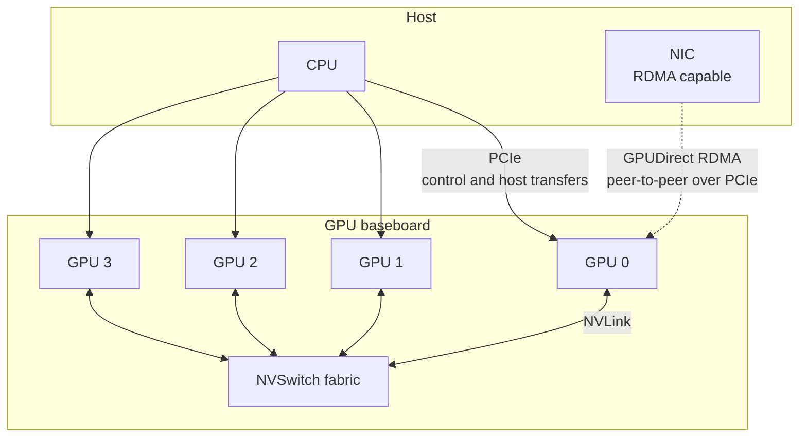

A GPU is reached over two distinct fabrics. PCIe carries control: config space,
register windows, and the interrupt line. NVLink, where present, carries data
between GPUs and sometimes between GPU and CPU. A machine with both routes the
same `cudaMemcpy` differently depending on which endpoints it connects.

## PCIe

Every GPU is a PCIe endpoint whatever else it is attached to. The kernel module
binds to it as an ordinary PCI driver.

| Structure | Contents |
| --- | --- |
| Config space | Vendor and device IDs, class code, capability list, the BAR sizing registers |
| BAR0 | The register aperture. Every hardware register the driver programs is a store into this window. |
| BAR1 | The device memory aperture the host uses to reach GPU memory directly |
| BAR3 | A further aperture, used for host access paths that vary by architecture |

BAR1 is sized at boot by platform firmware. Where it is smaller than device
memory, the host sees one window at a time and the driver moves that window to
reach the rest. Resizable BAR removes the limit: with it enabled and supported
by the platform firmware, BAR1 covers the whole of device memory and host
mappings need no window movement.

| Quantity | Command |
| --- | --- |
| Device and vendor IDs, link speed and width | `lspci -vvv -s <bdf>` |
| BAR sizes as assigned | `lspci -vvv` resource lines, or `/sys/bus/pci/devices/<bdf>/resource` |
| Current and maximum link generation | `nvidia-smi -q -d PCI` |

A GPU negotiating a lower link width than the slot supports indicates a
platform configuration or a physical seating fault. `nvidia-smi -q -d PCI`
names both the current value and the maximum.

## NVLink

| Generation | First part | Per-link bandwidth, each direction | Links per GPU |
| --- | --- | --- | --- |
| NVLink 1 | P100 | 20 GB/s | 4 |
| NVLink 2 | V100 | 25 GB/s | 6 |
| NVLink 3 | A100 | 25 GB/s | 12 |
| NVLink 4 | H100 | 25 GB/s | 18 |
| NVLink 5 | B200 | higher per link | more per GPU |

Aggregate figures quoted for a part are the per-link figure multiplied by the
link count and often by two for bidirectional traffic. Comparing a bidirectional
aggregate against a unidirectional PCIe figure overstates the ratio.

NVSwitch is a crossbar. Without it, GPUs are connected in a mesh and the
available bandwidth between two GPUs depends on how many links directly join
them. With it, every GPU reaches every other at full link bandwidth, so
all-to-all collectives run at a uniform rate on an 8-GPU baseboard.

`nvidia-smi topo -m` prints the matrix. The legend names each pair's connection:
NVLink counts, a PCIe host bridge, a CPU socket traversal, or a shared switch.

## Peer-to-peer

| Path | Requires | Used by |
| --- | --- | --- |
| GPU to GPU over NVLink | An NVLink route between the two | `cudaMemcpyPeer`, NCCL, unified memory migration |
| GPU to GPU over PCIe | `cudaDeviceCanAccessPeer` returning true, and no IOMMU translation in the way | The same calls, at lower bandwidth |
| NIC to GPU | `nvidia-peermem.ko` loaded, and an RDMA-capable NIC | GPUDirect RDMA, used by MPI and NCCL over the network |
| Storage to GPU | A supporting filesystem and driver stack | GPUDirect Storage |

`nvidia-peermem.ko` exists to register GPU memory with the kernel's RDMA
subsystem so that a NIC can DMA into it without a bounce through host memory.
Without it, a NIC writing to GPU memory stages through a host bounce buffer,
whatever NVLink topology the GPUs have between them.

Virtualisation affects peer-to-peer over PCIe. With an IOMMU translating device
addresses, one GPU's view of another's BAR may not be routable, and
`cudaDeviceCanAccessPeer` returns false on hardware that would otherwise
support it.

## Coherent attachment

On Grace Hopper and Grace Blackwell systems the CPU and GPU are joined by
NVLink-C2C, which is cache coherent.

| Consequence | Mechanism |
| --- | --- |
| One address space | The GPU walks the CPU's page tables through address translation services |
| No migration for correctness | A page is reachable from either side wherever it is resident |
| Migration for performance only | Placement still matters for bandwidth, so the advice APIs remain useful |
| `malloc` memory is addressable | No separate allocator is required to reach host data from a kernel |

## Worked example: one transfer, three routes

Copying 1 GB from GPU 0 to GPU 1.

| Route | Condition | Path taken |
| --- | --- | --- |
| NVLink direct | An NVLink route exists and peer access is enabled | Copy engine on GPU 0 reads its own memory and writes GPU 1's over NVLink |
| PCIe peer-to-peer | No NVLink, `cudaDeviceCanAccessPeer` true | Copy engine issues PCIe writes to GPU 1's BAR1 window through the host bridge |
| Staged through host | Peer access unavailable | Device to host copy into a bounce buffer, then host to device copy, so the data crosses PCIe twice |

Tracing the third route, which an application takes when peer access is
unavailable:

1. `cudaMemcpyPeer` finds peer access disabled between the two devices.
2. The runtime allocates or reuses a pinned host staging buffer.
3. A copy engine on GPU 0 reads device memory and writes the staging buffer
   over PCIe.
4. The runtime waits for that copy to complete.
5. A copy engine on GPU 1 reads the staging buffer over PCIe and writes its own
   device memory.
6. The call returns.

The transfer crossed PCIe twice and consumed host memory bandwidth for both
crossings, with a synchronisation point between them. Enabling peer access with
`cudaDeviceEnablePeerAccess` removes steps 2 through 4 entirely, and the same
1 GB moves once. `nvidia-smi topo -m` establishes in advance which of the three
routes a given pair will take.

## See also

- [Memory hierarchy](/gspwn/knowledgebase/memory-hierarchy/)
- [Installed stack](/gspwn/knowledgebase/installed-stack/)
- [Orchestration](/gspwn/knowledgebase/orchestration/)
