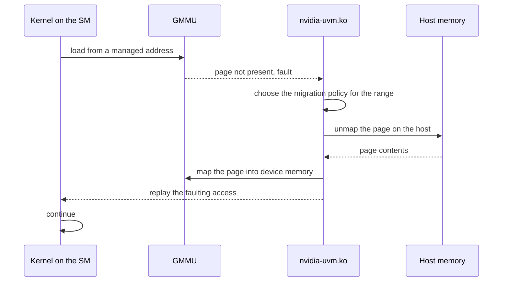

import MemoryScopes from '../../../components/MemoryScopes.astro';

CUDA exposes seven address spaces. They differ in how many threads can reach a
value and in where that value physically sits, and those two properties are
independent of each other.

<MemoryScopes />

## The spaces

| Space | Scope | Lifetime | Physically |
| --- | --- | --- | --- |
| Register | One thread | The thread | The SM's register file |
| Local | One thread | The thread | Device memory, cached in L1 and L2 |
| Shared | One block | The block | On-SM storage, sharing capacity with L1 |
| Global | Every thread and the host | The allocation | Device memory |
| Constant | Every thread, read-only | The allocation | A 64 KB window in device memory, with its own cache |
| Texture and surface | Every thread, read-only for texture | The allocation | Device memory, through a cache with filtering and addressing hardware |
| Host | The host | The allocation | System memory |

Local memory is device memory. The name states the scope, one thread, and says
nothing about where the storage sits. Local is where the compiler spills
registers, and where a thread-local array lands when it is indexed dynamically
so it cannot live in registers. A kernel that slows down after a small edit has
usually started spilling.

Shared memory and L1 share one physical block of storage on the SM. On Volta
and later the split is configurable, so a kernel using little shared memory
leaves more capacity as cache.

## Coalescing

A warp's 32 loads are serviced together. When those 32 addresses fall in the
same aligned 128-byte region, the hardware issues one transaction. When they
scatter, it issues up to 32.

| Access pattern | Transactions per warp |
| --- | --- |
| `a[i]` where `i` is the global thread index | 1 to 2 |
| `a[i * 2]` | 2 to 4 |
| `a[perm[i]]` with a random permutation | Up to 32 |

This is why array-of-structures layouts underperform structure-of-arrays on a
GPU. Reading one field from 32 consecutive structures strides through memory;
reading 32 consecutive values from one field array does not.

## Unified virtual addressing and unified memory

Two mechanisms are often conflated.

| Mechanism | Provides | Since |
| --- | --- | --- |
| Unified virtual addressing | One address space for host and device allocations, so a pointer's value identifies where it lives | Fermi, CUDA 4 |
| Unified memory | One allocation reachable from host and device, migrated between them on demand | Kepler, CUDA 6. Page faulting added in Pascal. |

`cudaMallocManaged` returns a pointer valid on both sides. On Pascal and later
the pages are not placed anywhere in particular at allocation. The first access
from either side takes a page fault, and the driver migrates the page to the
faulting processor.

| Call | Placement |
| --- | --- |
| `cudaMalloc` | Device memory. The host cannot dereference the pointer. |
| `cudaMallocHost` | Pinned host memory. Page-locked, so the GPU can DMA to it directly. |
| `cudaMallocManaged` | Unified. Migrated on fault. |
| `malloc` | Pageable host memory. A copy to the device stages through a pinned buffer first. |

`cudaMemPrefetchAsync` moves pages ahead of use, and `cudaMemAdvise` marks a
range as mostly-read or preferred-location. Both exist to avoid the repeated
faulting that first-touch access produces.

## The fault path

Unified memory faults are handled by `nvidia-uvm.ko`, separately from the
Resource Manager.



Two fault classes exist. A replayable fault stalls the warp, is serviced, and
the access is replayed; this is the normal migration path. A non-replayable
fault comes from an engine that cannot be replayed, such as a copy engine, and
is an error.

## Worked example: a first touch on managed memory

```
float *a;
cudaMallocManaged(&a, N * sizeof(float));   // 1
for (int i = 0; i < N; i++) a[i] = 1.0f;    // 2
kernel<<<blocks, threads>>>(a, N);          // 3
cudaDeviceSynchronize();                    // 4
printf("%f\n", a[0]);                       // 5
```

1. The allocation reserves address space in both page tables. No physical
   pages are committed.
2. The host loop faults on each new page. The driver commits system memory and
   maps it for the host. After the loop, every page is resident on the host.
3. The launch begins. The first warp touching each page takes a device fault.
   `nvidia-uvm.ko` unmaps the page from the host, migrates it to device memory,
   maps it, and replays the access. The kernel spends its early execution
   migrating.
4. The synchronise waits for the kernel and for the migrations it caused.
5. The host read faults again, and the page migrates back.

The same code with `cudaMemPrefetchAsync(a, bytes, deviceId)` between steps 2
and 3 moves every page in one operation, and the kernel starts with its data
already resident. Migration cost does not disappear; it stops being paid one
page fault at a time inside the kernel.

## See also

- [Execution model](/gspwn/knowledgebase/execution-model/)
- [Memory hierarchy](/gspwn/knowledgebase/memory-hierarchy/)
- [Installed stack](/gspwn/knowledgebase/installed-stack/)
