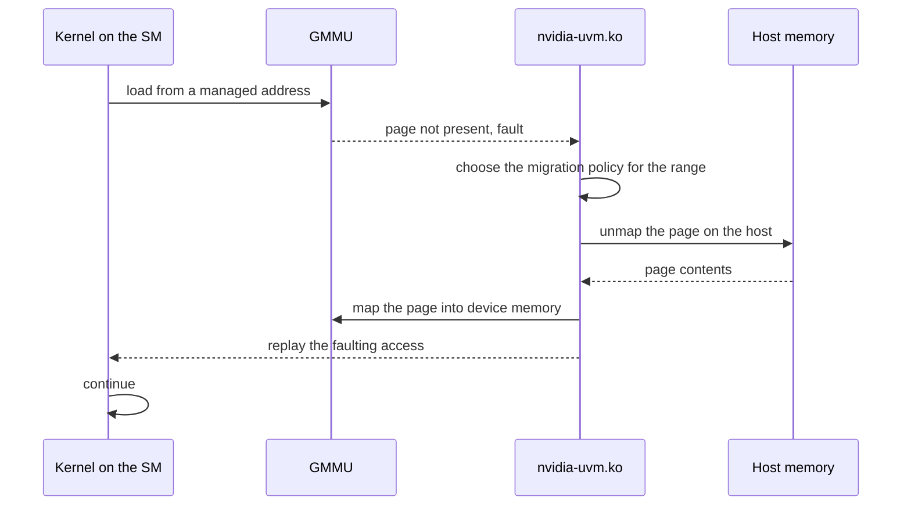

import MemoryScopes from '../../../components/MemoryScopes.astro';

CUDA exposes seven address spaces. They differ in how many threads can reach a
value and in which physical storage holds it, and those two properties are
independent of each other.

The figure orders storage by how far a value is visible, from one thread to the
host. It covers six of the seven spaces and adds the L1 and L2 caches, which
the hardware manages and a program does not address by name.

<MemoryScopes />

## The spaces

| Space | Scope | Lifetime | Physical storage |
| --- | --- | --- | --- |
| Register | One thread | The thread | The SM's register file |
| Local | One thread | The thread | Device memory, cached in L1 and L2 |
| Shared | One block | The block | On-SM storage, sharing capacity with L1 |
| Global | Every thread and the host | The allocation | Device memory |
| Constant | Every thread, read-only | The allocation | A 64 KB window in device memory, with its own cache |
| Texture and surface | Every thread, read-only for texture | The allocation | Device memory, through a cache with filtering and addressing hardware |
| Host | The host | The allocation | System memory |

Local memory is device memory. The name states the scope, one thread, and says
nothing about the storage behind it. Local is where the compiler spills
registers, and where it places a thread-local array that is indexed
dynamically, because a register file carries no index. A kernel that slows down
after a small edit has usually started spilling.

Shared memory and L1 share one physical block of storage on the SM. On Volta
and later the split is configurable, so a kernel using little shared memory
leaves more capacity as cache.

## Coalescing

Coalescing is the hardware merging the addresses a warp's 32 threads issue in
one instruction into as few memory transactions as it can. When those 32
addresses fall in the same aligned 128-byte region, the hardware issues one
transaction. When they scatter, it issues up to 32.

| Access pattern | Transactions per warp |
| --- | --- |
| `a[i]` where `i` is the global thread index | 1 to 2 |
| `a[i * 2]` | 2 to 4 |
| `a[perm[i]]` with a random permutation | Up to 32 |

Coalescing is the reason array-of-structures layouts underperform
structure-of-arrays on a GPU. Reading one field from 32 consecutive structures
strides through memory by the structure size. Reading 32 consecutive values
from one field array reads one contiguous region.

## Unified virtual addressing and unified memory

Two mechanisms share addresses between host and device.

- Unified virtual addressing gives one address space to host and device
  allocations, so a pointer's value identifies which of them holds it. It
  arrived with Fermi and CUDA 4.
- Unified memory gives one allocation reachable from host and device, migrated
  between them on demand. It arrived with Kepler and CUDA 6, and page faulting
  was added in Pascal.

`cudaMallocManaged` returns a pointer valid on both sides. On Pascal and later
it reserves address space and leaves every page unpopulated. The first access
from either side takes a page fault, and the driver migrates the page to the
faulting processor.

| Call | Placement |
| --- | --- |
| `cudaMalloc` | Device memory. The host cannot dereference the pointer. |
| `cudaMallocHost` | Pinned host memory. Page-locked, so the GPU can DMA to it directly. |
| `cudaMallocManaged` | Unified. Migrated on fault. |
| `malloc` | Pageable host memory. A copy to the device stages through a pinned buffer first. |

`cudaMemPrefetchAsync` moves pages ahead of use, and `cudaMemAdvise` marks a
range as mostly-read or preferred-location. Both bound the repeated faulting
that first-touch access produces.

## The fault path

Unified memory faults are handled by `nvidia-uvm.ko`, separately from the
Resource Manager. The GMMU is the GPU memory management unit, the hardware that
translates a device virtual address and raises the fault when no translation
exists.

The two fault classes and the structures the driver tracks residency in are on
[UVM subsystem](/gspwn/knowledgebase/uvm/).

## See also

- [UVM subsystem](/gspwn/knowledgebase/uvm/)
- [Execution model](/gspwn/knowledgebase/execution-model/)
- [Memory hierarchy](/gspwn/knowledgebase/memory-hierarchy/)
- [Installed stack](/gspwn/knowledgebase/installed-stack/)
