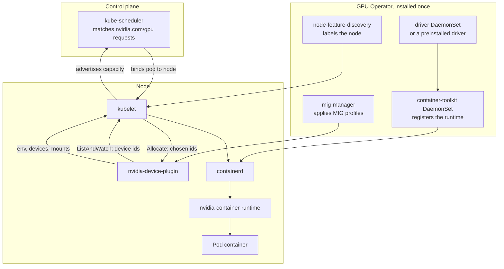

Kubernetes has no built-in knowledge of GPUs. A node advertises them as an
extended resource named `nvidia.com/gpu`, supplied by a device plugin installed
on top of the cluster. Everything below runs on one node.



## Components

| Component | Runs as | Responsibility |
| --- | --- | --- |
| `node-feature-discovery` | DaemonSet | Labels the node with its PCI devices, so GPU components schedule only where a GPU exists |
| Driver DaemonSet | Privileged DaemonSet | Builds and loads the kernel modules in a container, for clusters that do not preinstall the driver |
| Container toolkit DaemonSet | Privileged DaemonSet | Installs `nvidia-container-runtime` and edits the containerd configuration to register it |
| `nvidia-device-plugin` | DaemonSet | Discovers GPUs and reports them to the kubelet as `nvidia.com/gpu` |
| `dcgm-exporter` | DaemonSet | Exports utilisation, memory, temperature and Xid counters in Prometheus format |
| `mig-manager` | DaemonSet | Applies a named MIG layout from a node label and restarts the device plugin |
| GPU Operator | Deployment | Installs and reconciles all of the above from one custom resource |

The operator exists because the ordering matters. The driver has to be loaded
before the toolkit is configured, the toolkit before the device plugin can
report anything usable, and a driver upgrade has to drain GPU pods first.

## The device plugin protocol

The kubelet knows nothing about GPUs. It knows how to talk to a plugin over a
Unix socket in `/var/lib/kubelet/device-plugins/`, and the plugin supplies
everything device-specific.

| Call | Direction | Carries |
| --- | --- | --- |
| `Register` | Plugin to kubelet | The resource name, `nvidia.com/gpu`, and the plugin's socket |
| `ListAndWatch` | Plugin to kubelet, streaming | The current device id list and each device's health. The stream is how a device going unhealthy is reported. |
| `Allocate` | Kubelet to plugin | The device ids the kubelet chose for one container |
| `Allocate` response | Plugin to kubelet | Environment variables, device nodes and mounts to apply |

The plugin returns `NVIDIA_VISIBLE_DEVICES` set to the chosen UUIDs. That
variable is the entire interface between the plugin and the container toolkit.

## Resource names

| Resource | Advertised when |
| --- | --- |
| `nvidia.com/gpu` | Whole GPUs, or MIG instances under the single strategy |
| `nvidia.com/mig-1g.5gb` | MIG instances under the mixed strategy, one resource name per profile |

Under the single strategy every MIG instance is advertised as
`nvidia.com/gpu`, so a pod requesting one GPU may receive a `1g.5gb` slice. The
mixed strategy advertises each profile under its own name, so a pod asks for
the size it needs.

Extended resources are integers and cannot be over-committed. A pod requesting
`nvidia.com/gpu: 1` holds that device for its lifetime, and `limits` must equal
`requests`. Time-slicing changes this: the plugin can be configured to
advertise one physical GPU as several replicas, which lets several pods share
it with no isolation between them.

## Worked example: a pod requesting one GPU

```yaml
resources:
  limits:
    nvidia.com/gpu: 1
```

1. The device plugin has already registered with the kubelet and is streaming
   `ListAndWatch`, reporting two healthy device ids.
2. The kubelet adds `nvidia.com/gpu: 2` to the node's advertised capacity.
3. The scheduler finds a node whose allocatable `nvidia.com/gpu` exceeds what
   is already assigned, and binds the pod there.
4. The kubelet picks one free device id and calls `Allocate` on the plugin with
   it.
5. The plugin returns `NVIDIA_VISIBLE_DEVICES=GPU-<uuid>` for that id.
6. The kubelet passes the environment to containerd, which calls
   `nvidia-container-runtime`.
7. The admission path runs. The hook injects the driver libraries and the
   device nodes for that one UUID.
8. The container starts and `nvidia-smi -L` inside it lists exactly one GPU.

Steps 5 through 7 cross from orchestration into the admission path. A plugin
reporting a UUID that does not match the device it allocated produces a
container holding the wrong GPU, with no error raised at either layer.

## See also

- [Container admission path](/gspwn/knowledgebase/container-admission/)
- [Partitioning modes](/gspwn/knowledgebase/partitioning/)
- [Installed stack](/gspwn/knowledgebase/installed-stack/)
