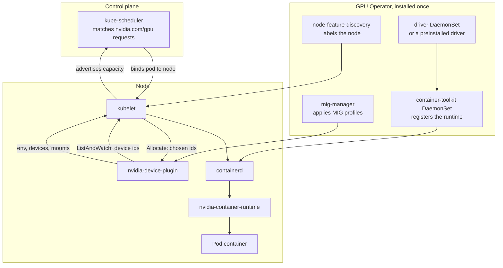

Kubernetes schedules GPUs through the same mechanism it uses for any hardware
it knows nothing about. A node advertises them as an extended resource named
`nvidia.com/gpu`, which is a countable quantity a pod asks for by name, and a
device plugin installed on top of the cluster supplies the count and the
per-container details. The diagram covers one node, plus the scheduler and the
operator that act on it from the control plane.

## Components

Seven components make up a GPU-enabled node. Six run as a DaemonSet, which is
one pod per matching node, and the seventh is a Deployment that reconciles the
rest.

| Component | Runs as | Responsibility |
| --- | --- | --- |
| `node-feature-discovery` | DaemonSet | Labels the node with its PCI devices, so GPU components schedule only where a GPU exists |
| Driver DaemonSet | Privileged DaemonSet | Builds and loads the kernel modules in a container, for clusters that do not preinstall the driver |
| Container toolkit DaemonSet | Privileged DaemonSet | Installs `nvidia-container-runtime` and edits the containerd configuration to register it |
| `nvidia-device-plugin` | DaemonSet | Discovers GPUs and reports them to the kubelet as `nvidia.com/gpu` |
| `dcgm-exporter` | DaemonSet | Exports utilisation, memory, temperature and Xid counters in Prometheus format |
| `mig-manager` | DaemonSet | Applies a named MIG layout from a node label and restarts the device plugin |
| GPU Operator | Deployment | Installs and reconciles all of the above from one custom resource |

The operator applies an ordering. The driver is loaded before the toolkit is
configured, the toolkit before the device plugin can report anything usable,
and a driver upgrade drains GPU pods first.

## The device plugin protocol

The kubelet, the agent running on every node, learns everything
device-specific from the plugin. The two speak gRPC over a Unix socket in
`/var/lib/kubelet/device-plugins/`.

| Call | Direction | Carries |
| --- | --- | --- |
| `Register` | Plugin to kubelet | The resource name, `nvidia.com/gpu`, and the plugin's socket |
| `ListAndWatch` | Plugin to kubelet, streaming | The current device id list and each device's health. A device going unhealthy is reported on this stream. |
| `Allocate` | Kubelet to plugin | The device ids the kubelet chose for one container |
| `Allocate` response | Plugin to kubelet | Environment variables, device nodes and mounts to apply |

The plugin returns `NVIDIA_VISIBLE_DEVICES` set to the chosen UUIDs. That
variable is the entire interface between the plugin and the container toolkit,
and the toolkit reads it exactly as it would from an image or a run command.

## Resource names

The plugin advertises one of two resource name shapes.

- `nvidia.com/gpu`, for whole GPUs, and for MIG instances under the single
  strategy.
- `nvidia.com/mig-1g.5gb`, for MIG instances under the mixed strategy, one
  resource name per profile.

Under the single strategy every MIG instance is advertised as
`nvidia.com/gpu`, so a pod requesting one GPU may receive a `1g.5gb` slice. The
mixed strategy advertises each profile under its own name, so a pod asks for
the size it needs.

Extended resources are integers and cannot be over-committed. A pod requesting
`nvidia.com/gpu: 1` holds that device for its lifetime, and `limits` must equal
`requests`. Time-slicing changes this: the plugin can be configured to
advertise one physical GPU as several replicas, which lets several pods share
it with no isolation between them.
[Partitioning modes](/gspwn/knowledgebase/partitioning/) states where the
isolation line falls in each sharing mode.

## See also

- [Container admission path](/gspwn/knowledgebase/container-admission/)
- [Partitioning modes](/gspwn/knowledgebase/partitioning/)
- [Installed stack](/gspwn/knowledgebase/installed-stack/)
