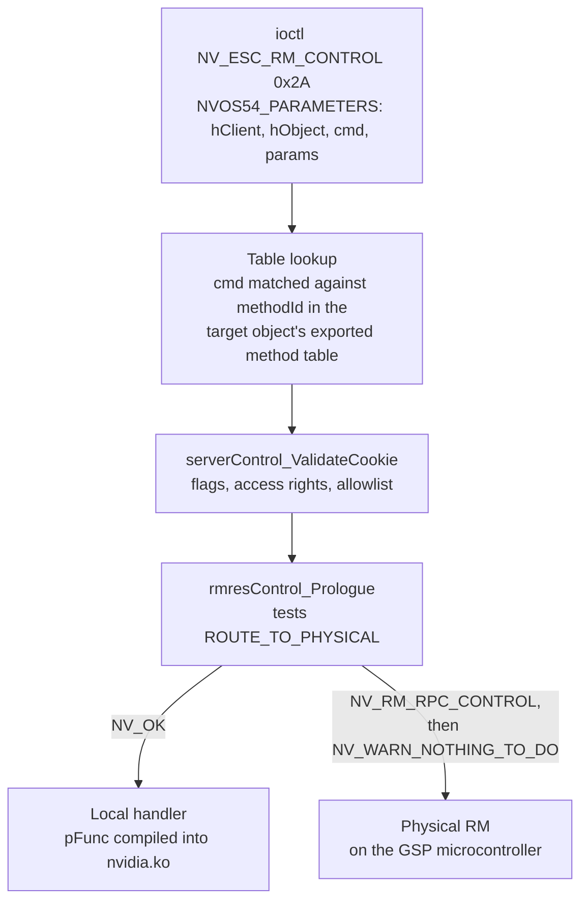

`NV_ESC_RM_CONTROL` is a single ioctl, escape `0x2A` in
`src/nvidia/arch/nvalloc/unix/include/nv_escape.h`. It takes an
`NVOS54_PARAMETERS` whose `cmd` field selects one of 1372 exported operations
and whose `params` pointer addresses a struct whose layout depends on that
command number. An enumeration that counts device-node entry points records one
target here, and the inventory below records 1372. The dispatch table is
generated into the driver source, so the whole space can be read without a GPU
attached.

The lookup is per object. `cmd` alone does not name a handler: five command
numbers are exported by `KernelChannel`, `KernelChannelGroupApi` and
`KernelGraphicsContext` alike, so the same value runs three different functions
depending on which object `hObject` names.

## The reachable subset

Most of the 1372 is closed to an unprivileged process, and the exclusions
compound. Each row removes commands the row above still counted.

| Population | Commands | Excluded because |
| --- | --- | --- |
| Exported by the generated NVOC tables | 1372 | |
| Internal | 241 | `INTERNAL` is tested first and rejects every ioctl-path caller |
| Kernel-only | 114 | No privilege bit set at all, which defaults to kernel |
| Privileged | 250 | `NV_ERR_INSUFFICIENT_PERMISSIONS` below root |
| Non-privileged | 767 | |
| Forwarded to the GSP | 236 | The CPU-side handler is compiled out, and the implementation is signed firmware |
| Targetable | 531 | |

679 of all 1372 commands are implemented on the GSP microcontroller and have no
handler in `nvidia.ko`. A static read of the kernel module cannot see into
them, and a KASAN build cannot instrument them. The 236 in the table above are
the subset of those 679 that survived the three privilege exclusions.

## Size against the other families

Control is the largest of the seven ioctl families a tenant can reach. The
seven together hold 852 targets.

| Family | Targets |
| --- | --- |
| `control`, one leaf of `NV_ESC_RM_CONTROL` | 531 |
| `alloc`, one leaf of `NV_ESC_RM_ALLOC` | 155 |
| `modeset`, one leaf of the single `/dev/nvidia-modeset` request number | 64 |
| `uvm`, one command of `/dev/nvidia-uvm` | 39 |
| `escape`, one `case` of the RM `switch` | 32 |
| `drm`, one command of `/dev/dri` | 24 |
| `uvm_tools`, one command of `/dev/nvidia-uvm-tools` | 7 |

## Object chains

A command is aimed at an object, so the owning class has to be allocated before
the command can be sent at all. The cost of reaching a control command is
therefore the cost of building its allocation chain.

Three counts describe how far that gets, over the same 531 commands.

| Measure | Commands | The remainder |
| --- | --- | --- |
| Naming an owning class in the export tables | 531 | |
| Whose owning class has an `RS_ENTRY` row | 516 | The 15 absent belong to `ProfilerBase`, 9 of them, and `Memory`, 6, both NVOC base classes |
| With a chain an unprivileged process can build | 514 | The 2 absent are on `MmuFaultBuffer` and `NvDispApi`, whose every external class requires allocation privilege |

The chain lengths concentrate at the short end. 418 of the 514 are reachable
within three allocations, and no chain runs longer than five.

| Chain length, allocations | Commands |
| --- | --- |
| 1 | 91 |
| 2 | 92 |
| 3 | 235 |
| 4 | 95 |
| 5 | 1 |

Every figure here is arithmetic over the `RS_ENTRY` table, so a chain the table
permits is not yet a chain an installed part accepts.

## Limits of a static enumeration

Four limits bound every count above.

- `paramSize` is `sizeof` a fixed struct. Where the real payload is a
  variable-length array behind an embedded `NvP64`, the recorded size describes
  the descriptor, and the true input size is a run-time function of a count
  field.
- `gpuValidateRmctrlCmd_HAL` is an allowlist consulted at dispatch, after the
  flag checks, so a command classified non-privileged here can still fail on a
  specific part.
- The GSP-resident commands are signed firmware, outside the tables entirely.
- vGPU and hypervisor paths take a separate rule set through
  `serverControl_ValidateVgpu`, which no static read reproduces.

Two run-time properties also move the boundary:
`PDB_PROP_SYS_ENABLE_RM_TEST_ONLY_CODE` gates 17 test-only commands, and
`g_resServ.bRsAccessEnabled` decides whether access rights are checked and
whether three commands are promoted to privileged.

The per-command breakdowns, the owning classes, the interface prefixes, the
parameter struct families and the ranking are on
[Control commands](/gspwn/reference/surface/control-commands/).

## See also

- [Resource Manager object model](/gspwn/knowledgebase/rm-object-model/)
- [GSP offload](/gspwn/knowledgebase/gsp-offload/)
- [Partitioning modes](/gspwn/knowledgebase/partitioning/)
