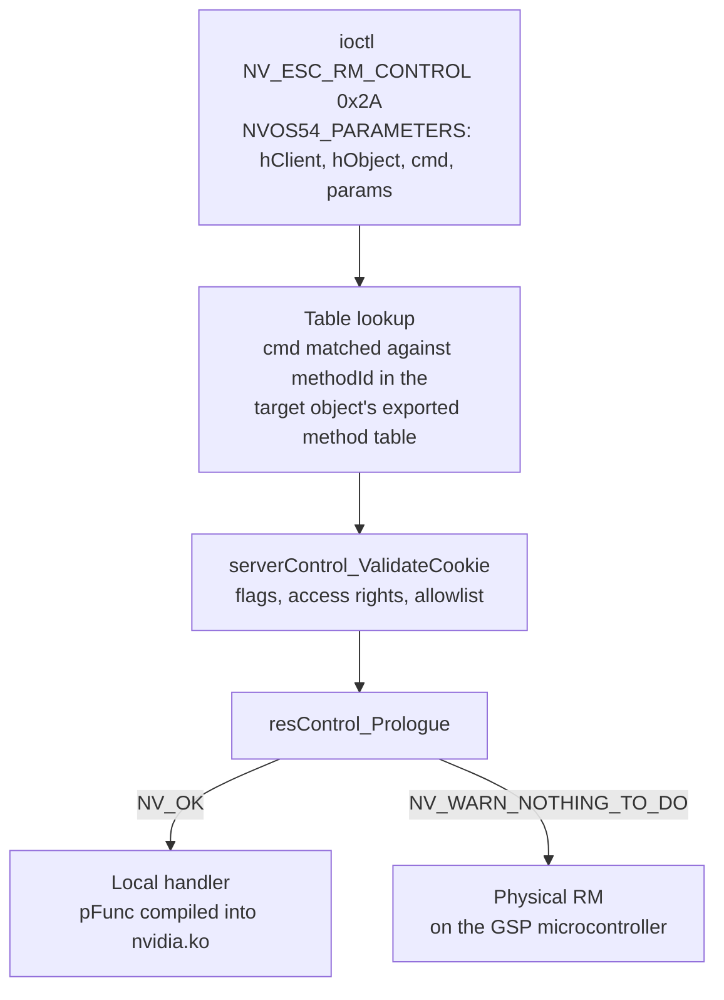

One ioctl carries the entire Resource Manager control interface.
`NV_ESC_RM_CONTROL`, escape `0x2A` in
`src/nvidia/arch/nvalloc/unix/include/nv_escape.h`, takes an
`NVOS54_PARAMETERS` whose `cmd` field selects the operation and whose `params`
pointer addresses a parameter struct whose layout depends on that command
number. The dispatch table behind `cmd` is generated into the driver source,
so the whole space can be read without a GPU attached.

## Measurement

Every number on this page comes from `open-gpu-kernel-modules` at
`610.57.04`, commit `e4a5faa`, read by `tools/ctrl_surface.py`. The generated
directory `src/nvidia/generated/` holds 268 C source files. 54 of them carry
56 tables named `__nvoc_exported_method_def_<Class>`, holding 1372 entries.
All 1372 parsed. Flag names come from
`src/nvidia/inc/kernel/rmapi/control.h` and access-right names from
`src/common/sdk/nvidia/inc/rs_access.h`, both read at run time, because both
move between driver branches.

## Export table entry

NVOC emits one entry per exported control method. Each entry is self
describing.

| Field | Contents |
| --- | --- |
| `methodId` | The value `NVOS54_PARAMETERS.cmd` must carry |
| `flags` | `RMCTRL_FLAGS_*` bitmask deciding privilege, locking, routing and caching |
| `accessRight` | `NVBIT(RS_ACCESS_*)` mask the caller must hold on the target object |
| `paramSize` | `sizeof` the parameter struct, or `0` for a method taking only the resource |
| `pClassInfo` | The resource class the command is issued against |
| `pFunc` | The handler, compiled to `NULL` when the command has no kernel-side implementation |
| `func` | The handler's name as a string, present when `NV_PRINTF_STRINGS_ALLOWED` |

The top 16 bits of `methodId` name the SDK interface the parameter struct
belongs to. Command `0x20800102` is an `NV2080` command, and its struct is
`NV2080_CTRL_GPU_GET_INFO_V2_PARAMS`.

## Totals

| Measure | Count |
| --- | --- |
| Exported control methods | 1372 |
| Distinct command numbers | 1362 |
| Command numbers exported by more than one class | 5 |
| Owning resource classes | 56 |
| SDK interface prefixes | 64 |
| Distinct parameter structs | 1265 |
| Methods with no parameter struct | 57 |

The five shared command numbers are `0x00900101`, `0x00900103`,
`0x00900105`, `0x00900107` and `0x0090010b`. Each is exported by
`KernelChannel`, `KernelChannelGroupApi` and `KernelGraphicsContext`, so the
handler reached depends on `hObject`, and the same `cmd` value runs three
different functions.

## Caller privilege

`rmControlValidateClientPrivilegeAccess` and `serverControl_ValidateCookie`
in `src/nvidia/src/kernel/rmapi/control.c` enforce four outcomes. Both
`RMCTRL_FLAGS_NONE` and `RMCTRL_FLAGS_KERNEL_PRIVILEGED` are defined as zero,
so a command carrying no privilege bit at all is kernel-only by default.

| Class | Commands | Flag condition | Result for a userspace caller |
| --- | --- | --- | --- |
| Non-privileged | 767 | `NON_PRIVILEGED` (`0x8`) set, `PRIVILEGED` and `INTERNAL` clear | Executes at any privilege level |
| Privileged | 250 | `PRIVILEGED` (`0x4`) set | `NV_ERR_INSUFFICIENT_PERMISSIONS` below `RS_PRIV_LEVEL_USER_ROOT` |
| Kernel-only | 114 | None of `NON_PRIVILEGED`, `PRIVILEGED`, `INTERNAL` set | `NV_ERR_INSUFFICIENT_PERMISSIONS` below `RS_PRIV_LEVEL_KERNEL` |
| Internal | 241 | `INTERNAL` (`0x80`) set | `NV_ERR_NOT_SUPPORTED` |

The flags overlap, and the order of the tests decides the outcome.
`INTERNAL` is tested first and rejects
any caller whose `RmApi` instance left `bApiLockInternal` and
`bGpuLockInternal` clear, which the ioctl path always does, so the 23
commands carrying `INTERNAL` together with `NON_PRIVILEGED` are unreachable
from userspace. `PRIVILEGED` is tested before the kernel-only default, so the
one command carrying both `PRIVILEGED` and `INTERNAL` never reaches the
privilege check at all.

Three further gates narrow the non-privileged set.

| Gate | Commands | Mechanism |
| --- | --- | --- |
| `RM_TEST_ONLY_CODE` | 17 (13 of them non-privileged) | `NV_ERR_TEST_ONLY_CODE_NOT_ENABLED` unless `PDB_PROP_SYS_ENABLE_RM_TEST_ONLY_CODE` is set |
| `PRIVILEGED_IF_RS_ACCESS_DISABLED` | 3 | `PRIVILEGED` is added to the flags when `g_resServ.bRsAccessEnabled` is false |
| `accessRight` non-zero | 5 | `rsAccessCheckRights` against the caller's rights on the target object, when access rights are enabled |

All five commands with a non-zero `accessRight` require `RS_ACCESS_NICE`, and
all five govern scheduling priority: `subdeviceCtrlCmdFifoRunlistSetSchedPolicy`,
`kchangrpapiCtrlCmdSetInterleaveLevel`, `kchangrpapiCtrlCmdMakeRealtime`,
`kchannelCtrlCmdSetInterleaveLevel` and `kchannelCtrlCmdRestartRunlist`.
Three of them also carry `PRIVILEGED_IF_RS_ACCESS_DISABLED`, so the same
command demands root on a build with access rights compiled out.

Of the 23 flag bits `control.h` defines, 22 appear on at least one exported
method. `RMCTRL_FLAGS_ALL_CLIENT_LOCK` (`0x200000`) appears on none.

## Kernel-side implementation

`NVOC_EXPORTED_METHOD_DISABLED_BY_FLAG` compiles `pFunc` to `NULL` when a
command carries `ROUTE_TO_PHYSICAL` without
`PHYSICAL_IMPLEMENTED_ON_VGPU_GUEST`. 753 commands carry
`ROUTE_TO_PHYSICAL`, and 679 of them have no handler in this tree. For those,
`resControl_Prologue` returns `NV_WARN_NOTHING_TO_DO` and the parameter
buffer is serialised across the RPC queue to the GSP, where the
implementation lives in signed firmware.

| Set | Total | Handler in `nvidia.ko` | Forwarded to the GSP |
| --- | --- | --- | --- |
| All exported methods | 1372 | 693 | 679 |
| Non-privileged | 767 | 531 | 236 |

## Owning classes

| Resource class | Commands | Non-privileged |
| --- | --- | --- |
| `Subdevice` | 641 | 289 |
| `DispCommon` | 157 | 20 |
| `RmClientResource` | 108 | 91 |
| `Device` | 60 | 46 |
| `KernelSMDebuggerSession` | 34 | 34 |
| `ProfilerBase` | 34 | 28 |
| `KernelChannel` | 32 | 26 |
| `GSyncApi` | 29 | 19 |
| `NvDispApi` | 27 | 16 |
| `VgpuConfigApi` | 26 | 22 |
| `DiagApi` | 19 | 17 |
| `KernelChannelGroupApi` | 17 | 14 |
| The remaining 44 classes | 188 | 145 |

`Subdevice` holds 47 percent of the surface on its own, and a client reaches
it immediately after allocating a root client and a device. The 44 classes in
the tail hold 14 percent between them.

## Interface prefixes

| Prefix | Commands | Non-privileged | Owning class |
| --- | --- | --- | --- |
| `NV2080` | 641 | 289 | `Subdevice` |
| `NV0073` | 157 | 20 | `DispCommon` |
| `NV0000` | 108 | 91 | `RmClientResource` |
| `NV0080` | 60 | 46 | `Device` |
| `NV83DE` | 34 | 34 | `KernelSMDebuggerSession` |
| `NVB0CC` | 34 | 28 | `ProfilerBase` |
| `NV30F1` | 29 | 19 | `GSyncApi` |
| `NVA081` | 26 | 22 | `VgpuConfigApi` |
| `NV208F` | 19 | 17 | `DiagApi` |
| `NV5070` | 18 | 10 | `NvDispApi` |
| `NV0090` | 15 | 15 | `KernelChannel`, `KernelChannelGroupApi`, `KernelGraphicsContext` |
| `NV0100` | 13 | 13 | `LockStressObject` |
| The remaining 52 prefixes | 218 | 163 | Various |

`NV0000` is the client-level interface, issued against the root client
handle. It needs no device and no GPU state beyond an open
`/dev/nvidiactl`, and 91 of its 108 commands are non-privileged.

## Parameter struct families

Command numbers and parameter structs share a prefix, so the interface table
above also describes the struct families. Within `NV2080`, the largest
interface, the second token of the struct name names the subsystem.

| Subsystem | Commands | Non-privileged |
| --- | --- | --- |
| `INTERNAL` | 186 | 2 |
| `GPU` | 94 | 77 |
| `NVLINK` | 57 | 20 |
| `GR` | 43 | 37 |
| `FB` | 37 | 23 |
| No parameter struct | 33 | 13 |
| `BUS` | 31 | 26 |
| `FIFO` | 23 | 14 |
| `CE` | 16 | 4 |
| `VGPU` | 15 | 0 |
| `PERF` | 13 | 13 |
| The remaining 27 subsystems | 93 | 60 |

1265 distinct structs cover 1315 commands. 41 structs are shared by more than
one command, covering 91 commands between them, and
`NV0090_CTRL_TPC_PARTITION_MODE_PARAMS` is shared by six. The remaining 57
commands have `paramSize` zero, meaning the handler takes only the resource
pointer and the caller supplies no parameter buffer at all.

## Non-privileged commands with kernel-side implementations

The selection below is mechanical. It takes the commands that are
non-privileged, free of `RM_TEST_ONLY_CODE` and
`PRIVILEGED_IF_RS_ACCESS_DISABLED`, have a handler compiled into `nvidia.ko`,
and have a parameter struct resolvable in the SDK headers. That set holds 474
commands. It scores each by the composition of its parameter struct, three
points per embedded `NvP64` user pointer, two per `NvHandle`, one per fixed
array up to eight, and breaks ties by ascending command number. Pointers and
handles rank above arrays because both are values the kernel dereferences
after validating them, and an array is a bound the kernel checks against a
caller-supplied count.

| Command | Class | Handler | Parameter struct | Ptr | Hnd | Arr |
| --- | --- | --- | --- | --- | --- | --- |
| `0x2080110b` | `Subdevice` | `subdeviceCtrlCmdFifoDisableChannels` | `NV2080_CTRL_FIFO_DISABLE_CHANNELS_PARAMS` | 1 | 4 | 4 |
| `0x00000283` | `RmClientResource` | `cliresCtrlCmdIdleChannels` | `NV0000_CTRL_GPU_IDLE_CHANNELS_PARAMS` | 3 | 2 | 0 |
| `0x00000127` | `RmClientResource` | `cliresCtrlCmdSystemGetP2pCaps` | `NV0000_CTRL_SYSTEM_GET_P2P_CAPS_PARAMS` | 2 | 0 | 2 |
| `0x0000013a` | `RmClientResource` | `cliresCtrlCmdSystemGetP2pCapsMatrix` | `NV0000_CTRL_SYSTEM_GET_P2P_CAPS_MATRIX_PARAMS` | 0 | 0 | 12 |
| `0x20800122` | `Subdevice` | `subdeviceCtrlCmdGpuExecRegOps` | `NV2080_CTRL_GPU_EXEC_REG_OPS_PARAMS` | 1 | 2 | 1 |
| `0x20801123` | `Subdevice` | `subdeviceCtrlCmdFifoGetChannelGroupUniqueIdInfo` | `NV2080_CTRL_FIFO_GET_CHANNEL_GROUP_UNIQUE_ID_INFO_PARAMS` | 0 | 2 | 3 |
| `0x20801124` | `Subdevice` | `subdeviceCtrlCmdFifoQueryChannelUniqueId` | `NV2080_CTRL_FIFO_QUERY_CHANNEL_UNIQUE_ID_PARAMS` | 0 | 2 | 3 |
| `0xa084010d` | `KernelHostVgpuDeviceApi` | `kernelhostvgpudeviceapiCtrlCmdBootloadVgpuTask` | `NVA084_CTRL_KERNEL_HOST_VGPU_DEVICE_BOOTLOAD_VGPU_TASK_PARAMS` | 0 | 3 | 1 |
| `0x00000130` | `RmClientResource` | `cliresCtrlCmdSystemExecuteAcpiMethod` | `NV0000_CTRL_SYSTEM_EXECUTE_ACPI_METHOD_PARAMS` | 2 | 0 | 0 |
| `0x00003d0b` | `RmClientResource` | `cliresCtrlCmdOsUnixExportObjectsToFd` | `NV0000_CTRL_OS_UNIX_EXPORT_OBJECTS_TO_FD_PARAMS` | 0 | 2 | 2 |
| `0x00003d0c` | `RmClientResource` | `cliresCtrlCmdOsUnixImportObjectsFromFd` | `NV0000_CTRL_OS_UNIX_IMPORT_OBJECTS_FROM_FD_PARAMS` | 0 | 2 | 2 |
| `0x00730120` | `DispCommon` | `dispcmnCtrlCmdSystemExecuteAcpiMethod` | `NV0073_CTRL_SYSTEM_EXECUTE_ACPI_METHOD_PARAMS` | 2 | 0 | 0 |
| `0x0080170d` | `Device` | `deviceCtrlCmdFifoGetChannelList` | `NV0080_CTRL_FIFO_GET_CHANNELLIST_PARAMS` | 2 | 0 | 0 |
| `0x0080180f` | `Device` | `deviceCtrlCmdDmaUpdatePde2` | `NV0080_CTRL_DMA_UPDATE_PDE_2_PARAMS` | 1 | 1 | 1 |
| `0x20800808` | `Subdevice` | `subdeviceCtrlCmdBiosGetSKUInfo` | `NV2080_CTRL_BIOS_GET_SKU_INFO_PARAMS` | 0 | 0 | 6 |
| `0x2080111a` | `Subdevice` | `subdeviceCtrlCmdFifoDisableChannelsForKeyRotation` | `NV2080_CTRL_FIFO_DISABLE_CHANNELS_FOR_KEY_ROTATION_PARAMS` | 0 | 2 | 2 |
| `0x2080111c` | `Subdevice` | `subdeviceCtrlCmdFifoRotateKeys` | `NV2080_CTRL_CMD_FIFO_ROTATE_KEYS_PARAMS` | 0 | 2 | 2 |
| `0x20802502` | `Subdevice` | `subdeviceCtrlCmdDmaInvalidateTLB` | `NV2080_CTRL_DMA_INVALIDATE_TLB_PARAMS` | 0 | 3 | 0 |
| `0xa0840105` | `KernelHostVgpuDeviceApi` | `kernelhostvgpudeviceapiCtrlCmdBindFecsEvtbuf` | `NVA084_CTRL_KERNEL_HOST_VGPU_DEVICE_BIND_FECS_EVTBUF_PARAMS` | 0 | 3 | 0 |
| `0x00000133` | `RmClientResource` | `cliresCtrlCmdSystemGetVgxSystemInfo` | `NV0000_CTRL_SYSTEM_GET_VGX_SYSTEM_INFO_PARAMS` | 0 | 0 | 5 |
| `0x00e00101` | `MemoryExport` | `memoryexportCtrlExportMem` | `NV00E0_CTRL_EXPORT_MEM_PARAMS` | 0 | 2 | 1 |
| `0xcb33010a` | `ConfidentialComputeApi` | `confComputeApiCtrlCmdGetGpuAttestationReport` | `NV_CONF_COMPUTE_CTRL_CMD_GET_GPU_ATTESTATION_REPORT_PARAMS` | 0 | 1 | 3 |
| `0x00000104` | `RmClientResource` | `cliresCtrlCmdSystemGetChipsetInfo` | `NV0000_CTRL_SYSTEM_GET_CHIPSET_INFO_PARAMS` | 0 | 0 | 4 |
| `0x0000012b` | `RmClientResource` | `cliresCtrlCmdSystemGetP2pCapsV2` | `NV0000_CTRL_SYSTEM_GET_P2P_CAPS_V2_PARAMS` | 0 | 0 | 4 |
| `0x0000013e` | `RmClientResource` | `cliresCtrlCmdSystemGetBuildVersionV2` | `NV0000_CTRL_SYSTEM_GET_BUILD_VERSION_V2_PARAMS` | 0 | 0 | 4 |

Across the 474 scored commands, 31 carry at least one embedded `NvP64`, 69
carry at least one `NvHandle`, and 172 carry at least one fixed array. The
embedded pointer cases are the ones where the kernel performs a second copy
from user memory after the ioctl layer has already copied the parameter
struct in, and `NV0000_CTRL_GPU_IDLE_CHANNELS_PARAMS` carries three such
pointers alongside a `numChannels` count that bounds all three.

## Export table against the SDK headers

The headers under `src/common/sdk/nvidia/inc/ctrl/` are the published
description of the command space. They do not agree with the export table.

| Measure | Count |
| --- | --- |
| `NVxxxx_CTRL_CMD_*` defines across 203 headers | 2623 |
| Distinct values behind those defines | 1787 |
| Distinct command numbers in the export tables | 1362 |
| Present in both | 1330 |
| Declared in a header with no NVOC export in this tree | 457 |
| Exported with no header name in this tree | 32 |

The 836-define gap between 2623 and 1787 comes from aliases: legacy names,
versioned names, and message-id companions pointing at one value. The 457
header-declared numbers with no export belong to classes whose
implementation is closed, absent from the open tree, or reached through a
path other than the NVOC method tables.
`subdeviceCtrlCmdGpuAcquireComputeModeReservation` at `0x20800145` is an
example of the reverse case: the export table names it, the SDK headers
mention it nowhere, and the command is non-privileged with no parameter
struct.

## Limits of a static enumeration

| Limit | Effect on the counts above |
| --- | --- |
| `paramSize` is `sizeof` a fixed struct | Commands whose real payload is a variable-length array behind an embedded `NvP64` report the size of the descriptor, and the true input size is a run-time function of a count field |
| `gpuValidateRmctrlCmd_HAL` allowlist | Dispatch consults a per-chip allowlist after the flag checks. A command classified non-privileged here can still return an error on a specific part |
| `PDB_PROP_SYS_ENABLE_RM_TEST_ONLY_CODE` | The 17 test-only commands depend on a system property whose value is a run-time decision |
| `g_resServ.bRsAccessEnabled` | Decides whether access rights are checked and whether `PRIVILEGED_IF_RS_ACCESS_DISABLED` promotes three commands to privileged |
| Closed-source components | The tables describe the kernel module only. The 679 commands with no local handler are implemented in GSP firmware, which this enumeration cannot see into |
| vGPU and hypervisor paths | `serverControl_ValidateVgpu` applies an entirely separate rule set when `hypervisorIsVgxHyper` holds, which no static read of the tables reproduces |

## See also

- [Resource Manager object model](/gspwn/knowledgebase/rm-object-model/)
- [GSP offload](/gspwn/knowledgebase/gsp-offload/)
- [Partitioning modes](/gspwn/knowledgebase/partitioning/)
