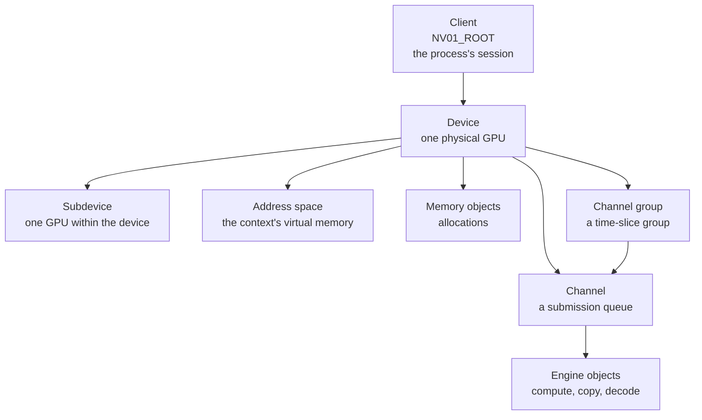

Every operation on an NVIDIA GPU is an operation on an object. Objects form a
tree, each one is named by a handle, and a handle is only meaningful to the
client that allocated it. Four escapes cover almost every operation, and the
variety comes from the class numbers and parameter structures passed through
them.

Edges are parent relationships as the driver's own class table declares them.
A memory object is mapped into an address space by a later call, which is not
a parent relationship and is not drawn here.

## The hierarchy

| Object | Parent | Object modelled |
| --- | --- | --- |
| Client | None. It is the root. | One process's session with the driver |
| Device | Client | A physical GPU as the client sees it |
| Subdevice | Device | One GPU, where a device may span several |
| Address space | Device, or subdevice | A virtual address space for a context |
| Memory | Device, subdevice or client root | An allocation, host or device |
| Channel group | Device | A group of channels scheduled together |
| Channel | Device, or channel group | A queue that work is pushed into |
| Engine object | Channel | A class binding the channel to compute, copy or a codec |

The authoritative list of legal parents per class is
`src/nvidia/src/kernel/rmapi/resource_list.h`, one `RS_ENTRY` record per class,
222 records at `610.57.04`. Three of those records carry depth 1 and name the
file descriptor itself as their parent: `NV01_ROOT`, `NV01_ROOT_NON_PRIV` and
`NV01_ROOT_CLIENT`. A class parented by the client root accepts any of the
three.

A channel accepts either the device or a channel group as its parent, so a
channel group is optional. No class in the table names an address space as its
parent, so mapping an allocation into an address space is a separate escape
acting on two existing handles.

### Memory class parents

The table carries 20 memory classes, counting every record whose internal
class is a memory resource and excluding the two `INLINE_TO_MEMORY` records,
which are graphics objects on a channel. The parent set splits them four ways.

| Parent set | Classes | Members |
| --- | --- | --- |
| The device alone | 8 | `NV01_MEMORY_FRAMEBUFFER_CONSOLE`, `NV01_MEMORY_LOCAL_PHYSICAL`, `NV01_MEMORY_LOCAL_PRIVILEGED`, `NV01_MEMORY_SYNCPOINT`, `NV01_MEMORY_SYSTEM`, `NV01_MEMORY_SYSTEM_OS_DESCRIPTOR`, `NV01_MEMORY_VIRTUAL`, `NV50_MEMORY_VIRTUAL` |
| The device or a subdevice | 5 | `NV01_MEMORY_HW_RESOURCES`, `NV01_MEMORY_LIST_FBMEM`, `NV01_MEMORY_LIST_OBJECT`, `NV01_MEMORY_LIST_SYSTEM`, `NV01_MEMORY_LOCAL_USER` |
| A subdevice alone | 2 | `NV_MEMORY_FABRIC`, `NV_MEMORY_MAPPER` |
| A client root | 5 | `NV01_MEMORY_DEVICELESS`, `NV_MEMORY_EXPORT`, `NV_MEMORY_FABRIC_IMPORT_V2`, `NV_MEMORY_FABRIC_IMPORTED_REF`, `NV_MEMORY_MULTICAST_FABRIC` |

## Handles

A handle is a 32-bit value chosen by the caller and validated by the driver
against the client that owns it. Handles are not global: the same numeric value
in two clients names two different objects, and a handle from one client
presented by another is rejected.

Destruction is recursive. Freeing the client frees everything under it, so
process exit cleans up the GPU without cooperation from the process.

## The escapes

The RM escape numbers are defined in
`src/nvidia/arch/nvalloc/unix/include/nv_escape.h:31-53`, which declares 23 of
them. `kernel-open/common/inc/nv-ioctl-numbers.h:34` carries `NV_IOCTL_BASE`
and the operating-system escapes that sit above it, a separate numbering. Four
of the 23 carry the object model.

| Escape | Number | Operation |
| --- | --- | --- |
| `NV_ESC_RM_ALLOC` | `0x2B` | Creates an object of a given class under a given parent, returning a handle |
| `NV_ESC_RM_FREE` | `0x29` | Destroys an object and everything under it |
| `NV_ESC_RM_CONTROL` | `0x2A` | Invokes a numbered command on an object. This is the large surface. |
| `NV_ESC_RM_MAP_MEMORY` | `0x4E` | Maps an allocation into a process or a device address space |

Each control command is a number selecting an operation on a class, with its
own parameter structure. The numbering is organised per class under
`src/common/sdk/nvidia/inc/ctrl/`, and the class numbers themselves under
`src/common/sdk/nvidia/inc/class/`.

The parameter structures for allocate, free and control are in
`src/common/sdk/nvidia/inc/nvos.h`. The values move between driver branches,
and reading them from a tree checked out at the matching tag is the only
reliable way to obtain them.

## Class numbers

An allocate call names the class of object to create. The class decides the
parameter structure, the valid parents, and which control commands the result
accepts.

| Class family | Selects |
| --- | --- |
| Root and device classes | The top of the tree |
| Address space and memory classes | How an allocation is backed and mapped |
| Channel classes | The submission mechanism, which is architecture-specific |
| Engine classes | Compute, copy, video decode and encode |
| Display classes | The display engine, absent on data centre parts |

Channel and engine classes carry the architecture in their names, because the
command formats differ per generation. A driver supporting several generations
carries several channel classes and picks the one matching the part.

## The UVM interface

`nvidia-uvm.ko` uses none of the escapes above. It exposes its own ioctl
numbering through `/dev/nvidia-uvm`, defined in
`kernel-open/nvidia-uvm/uvm_ioctl.h`, with its own conventions. The RM
convention predicts nothing about the UVM interface.
[UVM subsystem](/gspwn/knowledgebase/uvm/) states that numbering.

## Worked example: from root to a submitted kernel

1. Open `/dev/nvidiactl`. Allocate a client. The driver returns a handle
   naming this process's session.
2. Allocate a device under the client, naming which GPU. Allocate a subdevice
   under the device.
3. Allocate an address space object. This is the context's virtual memory, and
   every device pointer the process later holds is an offset in it.
4. Allocate memory objects for the kernel's data and map them into the address
   space. The mapping call returns the device virtual address.
5. Allocate a channel group, then a channel inside it. A channel may also be
   allocated directly under the device, and the group buys time-slice
   scheduling across several channels. The channel owns a pushbuffer: a ring in
   memory that commands are written into.
6. Allocate an engine object on the channel, using the compute class for this
   architecture. The channel is now bound to the compute engine.
7. Write the launch into the pushbuffer: the kernel's address, its grid and
   block dimensions, and its arguments.
8. Ring the doorbell. The GPU's scheduler picks the channel up on its next
   turn and the compute engine begins executing.

Every step from 1 to 6 is an allocate escape. Step 4 also uses map memory.
Steps 7 and 8 involve no ioctl at all: the pushbuffer and the doorbell are
memory the process already has mapped. Submission costs no system call, and
setup costs one per object created.

## See also

- [API split and contexts](/gspwn/knowledgebase/api-split/)
- [GSP offload](/gspwn/knowledgebase/gsp-offload/)
- [Scheduling and preemption](/gspwn/knowledgebase/scheduling/)
