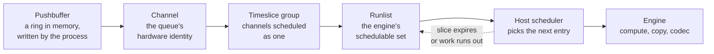

Work reaches a GPU engine through a queue the process writes into directly. The
submission path contains no system call, because the pushbuffer and the
doorbell are memory the process has already mapped. Scheduling between queues
is therefore performed by hardware and firmware, with no host involvement per
launch.

## The path

Six elements separate a process writing a command from an engine executing
it.

| Element | Holds |
| --- | --- |
| Pushbuffer | Command packets: launches, memory operations, semaphore waits and releases |
| Doorbell | A mapped register the process writes to signal new commands |
| Channel | The GPU's identity for one queue, with its own address space binding and context state |
| Timeslice group | Channels that share a slice, so a context's compute and copy channels are co-scheduled |
| Runlist | The ordered set of groups an engine cycles through |
| Host scheduler | The unit that walks the runlist, grants slices and initiates context switches |

A CUDA stream is a software abstraction above this. Several streams may map to
one channel, and the runtime decides. The number of hardware channels is
limited, so concurrency stops increasing past some number of streams.

## Time slicing

Contexts on one engine are multiplexed in time by default. Each group is
granted a slice, and at expiry the scheduler switches to the next group in the
runlist.

| Property | Behaviour |
| --- | --- |
| Slice length | Set per group by the driver, in microseconds |
| Order | Round robin within a priority level |
| Priority | Channels carry a priority, and higher levels are serviced first |
| Yield | A group with no runnable work releases the remainder of its slice |

Time slicing serialises contexts and partitions nothing. Two contexts sharing an
engine never run simultaneously, and each sees the full device while it runs.
The alternatives are covered in [partitioning modes](/gspwn/knowledgebase/partitioning/).

## Preemption granularity

Three granularities exist, and the finer the switch point the higher the cost.

| Granularity | Available from | Switch point | Cost |
| --- | --- | --- | --- |
| Draw or launch boundary | Early architectures | Between kernels | Low, and the latency is unbounded because a long kernel cannot be interrupted |
| Thread block | Kepler and later | Between block completions | Moderate |
| Instruction | Pascal and later | Any instruction | High, because the full SM state is saved |

Instruction-level preemption bounds a long-running kernel's effect on other
contexts. Every resident warp's registers, program counter and shared memory
must be written to memory and read back. That state runs to megabytes per SM,
and a preemption is measured in tens of microseconds.

## Context switch state

A switch saves five kinds of state, most of it into one save area in device
memory.

| State | Location |
| --- | --- |
| Register file contents for resident warps | A context save area in device memory |
| Shared memory contents | The same area |
| Program counters and predicate state | The same area |
| Channel and engine configuration | Instance memory belonging to the channel |
| Page table pointers | The channel's address space binding |

The save area is allocated when the channel is created, so channel creation
pays for it and the number of simultaneously resident contexts is bounded by
device memory.

## Faults and channel termination

Three conditions take a channel off the runlist.

| Condition | Behaviour | Rationale |
| --- | --- | --- |
| An illegal memory access by a kernel | The scheduler removes the channel from the runlist and the driver reports an Xid | The access cannot be completed and the engine cannot proceed past it |
| A kernel exceeding the launch timeout on a display-attached GPU | The watchdog kills it | A kernel holding the display engine indefinitely leaves the desktop frozen |
| A non-replayable fault from a copy engine | The channel is faulted off with no replay | The engine cannot re-issue the access |

Robust channel recovery decides what happens to the rest. Neighbouring channels
continue. The faulting context is left in an error state and every later call
on it returns an error. A context that has faulted stays faulted, and
`cudaDeviceReset` destroys it and builds a new one.

## Multi-Process Service

MPS replaces time slicing between processes with a single shared context.

| Property | Under time slicing | Under MPS |
| --- | --- | --- |
| Processes on one GPU | Serialised by slice | Concurrent, sharing SMs |
| Context switches | On every slice expiry | None between clients |
| Memory protection | Per-context address spaces | Per-client address spaces from Volta onward |
| Failure containment | A faulting context affects itself | A fatal fault can affect other clients on pre-Volta parts |
| Resource control | None | `CUDA_MPS_ACTIVE_THREAD_PERCENTAGE` caps a client's SM share |

MPS raises utilisation where many processes each launch kernels too small to
fill the device. It provides no memory bandwidth or capacity isolation.

## See also

- [Resource Manager object model](/gspwn/knowledgebase/rm-object-model/)
- [Partitioning modes](/gspwn/knowledgebase/partitioning/)
- [Execution model](/gspwn/knowledgebase/execution-model/)
