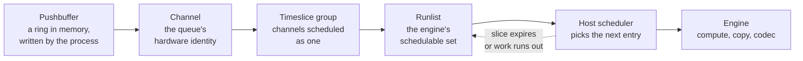

Work reaches a GPU engine through a queue the process writes into directly.
Nothing in the submission path is a system call, which is what makes launches
cheap and also what makes the scheduler entirely a hardware and firmware
concern.

## The path

| Element | Holds |
| --- | --- |
| Pushbuffer | Command packets: launches, memory operations, semaphore waits and releases |
| Doorbell | A mapped register the process writes to signal new commands |
| Channel | The GPU's identity for one queue, with its own address space binding and context state |
| Timeslice group | Channels that share a slice, so a context's compute and copy channels are co-scheduled |
| Runlist | The ordered set of groups an engine cycles through |
| Host scheduler | The unit that walks the runlist, grants slices and initiates context switches |

A CUDA stream is a software abstraction above this. Several streams may map to
one channel, and the runtime decides. The number of hardware channels is
limited, which is why creating unbounded numbers of streams stops producing
additional concurrency at some point.

## Time slicing

Contexts on one engine are multiplexed in time by default. Each group is
granted a slice, and at expiry the scheduler switches to the next group in the
runlist.

| Property | Behaviour |
| --- | --- |
| Slice length | Set per group by the driver, in microseconds |
| Order | Round robin within a priority level |
| Priority | Channels carry a priority; higher levels are serviced first |
| Yield | A group with no runnable work releases the remainder of its slice |

Time slicing gives isolation in time and none in space. Two contexts sharing an
engine never run simultaneously, and each sees the full device while it runs.
The alternatives are covered in [partitioning modes](/gspwn/knowledgebase/partitioning/).

## Preemption granularity

| Granularity | Available from | Switch point | Cost |
| --- | --- | --- | --- |
| Draw or launch boundary | Early architectures | Between kernels | Low, and the latency is unbounded because a long kernel cannot be interrupted |
| Thread block | Kepler and later | Between block completions | Moderate |
| Instruction | Pascal and later | Any instruction | High, because the full SM state is saved |

Instruction-level preemption is what makes a long-running kernel bounded in its
effect on other contexts. The cost is the state: every resident warp's
registers, program counter and shared memory must be written to memory and read
back. That state runs to megabytes per SM, and it is why a preemption is
measured in tens of microseconds.

## Context switch state

| Saved | Where |
| --- | --- |
| Register file contents for resident warps | A context save area in device memory |
| Shared memory contents | The same area |
| Program counters and predicate state | The same area |
| Channel and engine configuration | Instance memory belonging to the channel |
| Page table pointers | The channel's address space binding |

The save area is allocated when the channel is created, which is part of why
context creation is expensive and why the number of simultaneously resident
contexts is bounded by memory.

## Faults and channel termination

| Condition | Result |
| --- | --- |
| An illegal memory access by a kernel | The channel faults. The scheduler removes it from the runlist and reports an Xid. |
| A kernel exceeding the launch timeout on a display-attached GPU | The channel is killed by the watchdog |
| A non-replayable fault from a copy engine | The channel is faulted off with no replay |
| Robust channel recovery | Neighbouring channels continue. The faulting context is left in an error state and every later call on it returns an error. |

A context that has faulted is not recoverable. `cudaDeviceReset` destroys it and
builds a new one; the process cannot continue with the old one.

## Multi-Process Service

MPS replaces time slicing between processes with a single shared context.

| Property | Under time slicing | Under MPS |
| --- | --- | --- |
| Processes on one GPU | Serialised by slice | Concurrent, sharing SMs |
| Context switches | On every slice expiry | None between clients |
| Memory protection | Per-context address spaces | Per-client address spaces from Volta onward |
| Failure containment | A faulting context affects itself | A fatal fault can affect other clients on pre-Volta parts |
| Resource control | None | `CUDA_MPS_ACTIVE_THREAD_PERCENTAGE` caps a client's SM share |

MPS suits many small kernels from many processes, where each alone leaves most
of the device idle. It provides no memory bandwidth or capacity isolation.

## Worked example: a slice expiring

Two processes each running long compute kernels on one GPU without MPS.

1. Process A's context holds the compute engine. Its timeslice group is at the
   head of the runlist and its kernels are executing on all SMs.
2. The host scheduler's slice timer expires.
3. The scheduler signals a preemption request to the compute engine.
4. The engine reaches a preemption point. With instruction-level preemption
   this is the next instruction boundary, so it does not wait for a kernel or
   even a thread block to complete.
5. Every SM writes its resident warp state, register file contents and shared
   memory into context A's save area in device memory.
6. The channel's instance memory is updated with the resume point.
7. The scheduler binds context B's channel: its page tables become active and
   its save area is read back into the SMs.
8. Execution resumes inside B's kernels at the instruction each warp had
   reached on its previous slice.
9. At the next expiry the process reverses.

Steps 5 and 7 move the same data twice per switch. The device is doing no
useful work throughout, which is the cost that MIG and MPS avoid by not
switching at all.

## See also

- [Resource Manager object model](/gspwn/knowledgebase/rm-object-model/)
- [Partitioning modes](/gspwn/knowledgebase/partitioning/)
- [Execution model](/gspwn/knowledgebase/execution-model/)
