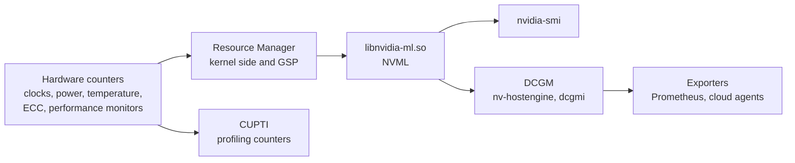

GPU counters originate in hardware registers and reach every consumer through
one interface. The Resource Manager reads the registers, NVML exposes them, and
`nvidia-smi`, DCGM and the Prometheus exporters are clients of NVML. CUPTI
reaches the performance monitors on a separate path and requires privileges
NVML does not.

Field values are sampled on a driver-internal interval. A query returns the most
recent sample, so two consecutive queries can return identical figures, and a
spike shorter than the interval falls between samples and is never reported.

## Utilisation

| Field | Measures |
| --- | --- |
| `utilization.gpu` | The percentage of the sampling period during which at least one kernel was resident |
| `utilization.memory` | The percentage of the period during which device memory was being read or written |
| SM occupancy | The ratio of resident warps to the maximum, reported by profilers |
| SM activity | The proportion of SMs with at least one active warp, reported by DCGM |

`utilization.gpu` at 100% establishes that a kernel was always running. It
establishes nothing about how much of the device that kernel used. A kernel
occupying one SM out of 108 for the whole period reports the same 100% as one
saturating the part. The DCGM fields are the ones to read for that question:
`DCGM_FI_PROF_SM_ACTIVE`, `DCGM_FI_PROF_SM_OCCUPANCY` and
`DCGM_FI_PROF_PIPE_TENSOR_ACTIVE`.

## Clocks and throttling

| Field | Reports |
| --- | --- |
| `clocks.current.sm` | The SM clock at the sample |
| `clocks.max.sm` | The maximum the part will reach |
| `clocks.applications.graphics` | An operator-set target, where one has been applied |
| `clocks_throttle_reasons.active` | A bitmask naming why the clock is below maximum |

| Throttle reason | Cause |
| --- | --- |
| SW power cap | The power limit was reached. Raise it with `nvidia-smi -pl` where the part allows. |
| HW thermal slowdown | The part crossed its thermal threshold. An airflow or ambient problem. |
| HW power brake | An external signal from the platform asserted the brake line |
| SW thermal slowdown | The driver reduced clocks ahead of the hardware threshold |
| Sync boost | The part is in a sync boost group and matched to a slower peer |
| Applications clocks setting | An operator set a clock below the maximum |
| Display clock setting | A display configuration constrains the clock |

A GPU reporting high utilisation and low throughput with a power cap throttle
active is power limited. The same GPU with a thermal slowdown active is a
cooling problem. The two are read from one field.

## Xid

Xid entries are the driver's numbered error reports, written to the kernel log
and counted by NVML.

| Read from | Command |
| --- | --- |
| The kernel log, with PID and channel where available | `dmesg -T \| grep -i xid` |
| The most recent Xid as a DCGM field | `dcgmi dmon -e 230`, field `DCGM_FI_DEV_XID_ERRORS` |
| Continuous monitoring with classification | `dcgmi diag` and the DCGM health checks |

The kernel log is the primary source. `nvidia-smi` has no Xid history query:
the ECC and page-retirement sections it prints are separate counters that some
Xid classes correlate with, and reading them is not a substitute for the log.

An Xid names a class of fault. Attribution to a process is present for some
classes and absent for others, because a fault reported by the GSP after a
context has already been torn down carries no owner.

## ECC and page retirement

| Field | Meaning |
| --- | --- |
| Volatile corrected errors | Single-bit errors since the last driver reload |
| Aggregate corrected errors | Single-bit errors over the part's lifetime, held in board storage |
| Uncorrectable errors | Double-bit errors. Each raises an Xid and may kill a context. |
| Retired pages, single-bit | Pages retired after repeated correctable errors |
| Retired pages, double-bit | Pages retired after an uncorrectable error |
| Pending retirement | A retirement scheduled for the next reset |

Row remapping on HBM parts replaces the older page retirement model.
`nvidia-smi -q -d ROW_REMAPPER` reports the counts and whether a remapping
failure has occurred, which is a condition requiring the part to be taken out of
service.

## Processes and memory

| Field | Reports |
| --- | --- |
| `memory.used` | Device memory allocated, including driver overhead |
| `memory.total` | Capacity as the driver sees it, which on parts where ECC reserves memory is below the advertised figure |
| Compute processes | PIDs holding a context, with their memory usage |
| `nvidia-smi pmon` | Per-process utilisation sampled over time |

Inside a container the process list is often empty even while memory is in use,
because the PIDs belong to a namespace the tool cannot resolve. The memory
figures remain correct.

## DCGM

| Component | Role |
| --- | --- |
| `nv-hostengine` | The daemon that samples and serves fields |
| `dcgmi` | The command-line client |
| Field groups | Named sets of fields sampled together |
| Health checks | Threshold-based classification of counters into pass, warn and fail |
| `dcgmi diag` | An active diagnostic that runs workloads on the part, at three depth levels |

`dcgmi diag -r 3` runs the deepest level and takes the GPU out of service while
it runs. The lower levels are safe alongside a workload.

## Worked example: a device at 100% utilisation and low throughput

An inference service reports a third of its expected throughput. The GPU shows
`utilization.gpu` at 99%.

1. `nvidia-smi --query-gpu=utilization.gpu,clocks.current.sm,clocks.max.sm,power.draw,power.limit,temperature.gpu --format=csv`
   reports the SM clock at half its maximum, power draw at the limit, and
   temperature well inside the threshold.
2. `nvidia-smi --query-gpu=clocks_throttle_reasons.active --format=csv` returns
   the software power cap bit. The part is power limited, not thermally limited.
3. `nvidia-smi -q -d POWER` shows the enforced limit below the default, which
   points at an operator setting or a platform constraint.
4. `dcgmi dmon -e 1002,1004` reports SM activity at 12% and tensor pipe activity
   near zero. Most of the device is idle even though a kernel is always
   resident.
5. Those two facts together identify the shape of the problem: small kernels
   launched back to back, each occupying a fraction of the device, keeping
   `utilization.gpu` pinned at 99% while the SMs are mostly empty.
6. `nvidia-smi pmon -i 0` shows one process, so the device is not being shared.
7. The power cap and the low SM activity have separate causes. Raising the
   power limit recovers clock headroom; the throughput ceiling requires larger
   batches or concurrent streams to fill the SMs.

Steps 1 through 3 use `nvidia-smi` alone and identify the power cap. Step 4
requires DCGM and identifies the occupancy ceiling, which accounts for the
larger part of the shortfall. A diagnosis stopping at step 3 raises the power
limit and recovers the clock, leaving most of the throughput gap in place.

## See also

- [Installed stack](/gspwn/knowledgebase/installed-stack/)
- [Chip organisation](/gspwn/knowledgebase/chip-organisation/)
- [Orchestration](/gspwn/knowledgebase/orchestration/)
