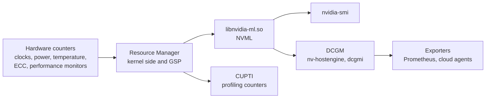

GPU counters originate in hardware registers. The Resource Manager reads the
registers, NVML exposes them, and `nvidia-smi` and DCGM are clients of NVML.
NVML is the NVIDIA Management Library, shipped as `libnvidia-ml.so`. DCGM is
the Data Center GPU Manager, a sampling daemon with its own client. The
Prometheus exporters read DCGM. CUPTI, the CUDA Profiling Tools Interface,
reaches the performance monitors on a separate path.

The performance monitors CUPTI reads are gated by a module parameter.
`NVreg_RestrictProfilingToAdminUsers` compiles in at `1`
(`kernel-open/nvidia/nv-reg.h:1034`), so a process needs `CAP_SYS_ADMIN` to
read GPU performance counters. The comment block documenting the option states
`0` as its default (`kernel-open/nvidia/nv-reg.h:516`), which the definition
below it contradicts.

Field values are sampled on a driver-internal interval, between 1 second and
1/6 second depending on the part
(`vendor/github.com/NVIDIA/go-nvml/pkg/nvml/nvml.h:249`). A query returns the
most recent sample, so two consecutive queries can return identical figures,
and a spike shorter than the interval falls between samples and is never
reported.

## Utilisation

Four fields describe how busy a part is, and each measures something
different.

| Field | Measures |
| --- | --- |
| `utilization.gpu` | The percentage of the sample period during which one or more kernels was executing on the GPU |
| `utilization.memory` | The percentage of the sample period during which device memory was being read or written |
| SM occupancy | The ratio of resident warps to the architectural maximum, reported by profilers |
| SM activity | The proportion of SMs with at least one active warp, reported by DCGM |

The first two definitions are the doc comments on `nvmlUtilization_t`
(`vendor/github.com/NVIDIA/go-nvml/pkg/nvml/nvml.h:253`).

`utilization.gpu` at 100% establishes that a kernel was always executing. It
establishes nothing about how much of the device that kernel used. A kernel
occupying one SM out of 108 for the whole period reports the same 100% as one
saturating the part. DCGM reports the occupancy directly, through
`DCGM_FI_PROF_SM_ACTIVE`, `DCGM_FI_PROF_SM_OCCUPANCY` and
`DCGM_FI_PROF_PIPE_TENSOR_ACTIVE`.

## Clocks and clock event reasons

Four fields report the clock and the reason it holds that value.

| Field | Reports |
| --- | --- |
| `clocks.current.sm` | The SM clock at the sample |
| `clocks.max.sm` | The maximum the part will reach |
| `clocks.applications.graphics` | An operator-set target, where one has been applied |
| `clocks_throttle_reasons.active` | A bitmask naming why the clock holds its current value |

Nine bits are defined in the bitmask, at
`vendor/github.com/NVIDIA/go-nvml/pkg/nvml/nvml.h:3343` and the eight defines
after it. The header uses two prefixes for one family: six carry
`nvmlClocksEventReason` and three carry the older `nvmlClocksThrottleReason`.

| Reason | Bit | Cause the header states |
| --- | --- | --- |
| GPU idle | `0x1` | Nothing is running on the GPU and the clocks are dropping to idle |
| Applications clocks setting | `0x2` | Clocks are set to application-specific values |
| SW power cap | `0x4` | Clocks were reduced to hold the part inside its current power limit |
| HW slowdown | `0x8` | Hardware cut the core clock by a factor of two or more. Temperature too high, an external power brake asserted, fast trigger power protection, or a P-state change |
| Sync boost | `0x10` | The part is in a sync boost group and holds the lowest clock any member can reach |
| SW thermal slowdown | `0x20` | The driver reduced clocks to hold GPU and memory temperature under their maximum operating temperatures |
| HW thermal slowdown | `0x40` | Hardware cut the core clock by a factor of two or more because temperature is too high |
| HW power brake slowdown | `0x80` | Hardware cut the core clock by a factor of two or more because the platform asserted the external power brake |
| Display clock setting | `0x100` | The display clock setting limits the GPU clock |

Two of the nine describe a healthy part. GPU idle means no work is resident,
and applications clocks setting means an operator asked for the clock the part
is holding, which `nvidia-smi -ac` sets and `nvidia-smi -rac` clears.

A GPU reporting high utilisation and low throughput with SW power cap active is
power limited, and `nvidia-smi -pl` raises the limit where the part allows it.
The same GPU with either thermal slowdown active is a cooling problem, and the
power limit has no effect on it.

## Xid

Xid entries are the driver's numbered error reports, written to the kernel log
and counted by NVML.

Three sources report them.

- The kernel log, which carries the PID and channel where available. Read it
  with `dmesg -T | grep -i xid`.
- DCGM, which exposes the most recent Xid as field `DCGM_FI_DEV_XID_ERRORS`,
  read with `dcgmi dmon -e 230`.
- `dcgmi diag` and the DCGM health checks, for continuous monitoring with
  classification.

The kernel log is the primary source. `nvidia-smi` has no Xid history query.
The ECC and page-retirement sections it prints are separate counters that some
Xid classes correlate with. The log carries the Xid number, the PID and the
channel, which those counters omit.

An Xid names a class of fault. Attribution to a process is present for some
classes and absent for others, because a fault reported by the GSP after a
context has already been torn down carries no owner.

## ECC and page retirement

Six counters cover error correction and the pages retired as a result.

| Field | Meaning |
| --- | --- |
| Volatile corrected errors | Single-bit errors since the driver last loaded |
| Aggregate corrected errors | Single-bit errors persisting across reboots, for the lifetime of the part |
| Uncorrectable errors | Double-bit errors. Each raises an Xid and may kill a context. |
| Retired pages, single-bit | Pages retired after repeated correctable errors |
| Retired pages, double-bit | Pages retired after an uncorrectable error |
| Pending retirement | A retirement scheduled for the next reset |

The volatile and aggregate split is `nvmlEccCounterType_t`, and the two
retirement causes are `nvmlPageRetirementCause_t`
(`vendor/github.com/NVIDIA/go-nvml/pkg/nvml/nvml.h:1360`).

Row remapping on HBM parts replaces the older page retirement model.
`nvidia-smi -q -d ROW_REMAPPER` reports the counts and whether a remapping
failure has occurred, which is a condition requiring the part to be taken out of
service.

## Processes and memory

Four fields report device memory and the processes holding it.

| Field | Reports |
| --- | --- |
| `memory.used` | Reserved plus allocated device memory. The driver always sets aside a small amount for bookkeeping. |
| `memory.total` | Total physical device memory as the driver reports it, which on parts where ECC reserves memory is below the advertised figure |
| Compute processes | PIDs holding a context, with their memory usage |
| `nvidia-smi pmon` | Per-process utilisation sampled over time |

The first two definitions are the doc comments on `nvmlMemory_t`
(`vendor/github.com/NVIDIA/go-nvml/pkg/nvml/nvml.h:261`).

Inside a container the process list is often empty even while memory is in use,
because the PIDs belong to a namespace the tool cannot resolve. The memory
figures remain correct.

## DCGM

Five components make up DCGM.

| Component | Role |
| --- | --- |
| `nv-hostengine` | The daemon that samples and serves fields |
| `dcgmi` | The command-line client |
| Field groups | Named sets of fields sampled together |
| Health checks | Threshold-based classification of counters into pass, warn and fail |
| `dcgmi diag` | An active diagnostic that runs workloads on the part, at a depth selected by `-r` |

`dcgmi diag -r 3` runs the long level and takes the GPU out of service while it
runs. DCGM ships outside the trees this documentation reads, so its field ids
and level names come from the vendor documentation and not from source in this
repository.

## See also

- [Installed stack](/gspwn/knowledgebase/installed-stack/)
- [Chip organisation](/gspwn/knowledgebase/chip-organisation/)
- [Orchestration](/gspwn/knowledgebase/orchestration/)
