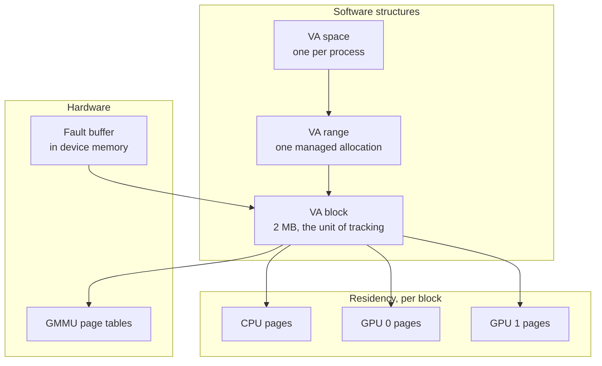

`nvidia-uvm.ko` is a separate driver from `nvidia.ko` with its own device node,
its own ioctl numbering and its own view of memory. It makes one allocation
addressable from the CPU and from every GPU in the system, and migrates pages so
that the processor accessing them holds them locally.

## Structures

| Structure | Scope | Holds |
| --- | --- | --- |
| VA space | One process | Every managed range, and which GPUs are registered to it |
| VA range | One allocation | The range's policy: preferred location, accessed-by set, read-duplication |
| VA block | 2 MB of a range | Per-page residency and mapping state for every processor |

The VA block carries the per-page state. It tracks, for each page it covers,
which processors hold a copy and which have it mapped. A migration is a change
to that state plus the page table updates that follow from it.

## Fault classes

| Class | Raised by | Handling |
| --- | --- | --- |
| Replayable | An SM executing a memory instruction | The warp stalls, the driver services the fault, the access is replayed. This is the migration path. |
| Non-replayable | A copy engine or another engine that cannot re-issue | The channel is faulted off. There is no replay, so it is reported as an error. |

Replayable faults are batched. The hardware writes entries into a fault buffer
in device memory and raises an interrupt; the driver drains many entries at
once, coalesces those hitting the same block, services them, and issues a
single replay. Servicing one fault at a time would make first-touch migration
unusable.

## Migration policies

| Policy | Set by | Effect |
| --- | --- | --- |
| First touch | The default | A page migrates to whichever processor faults on it |
| Preferred location | `cudaMemAdvise` with `SetPreferredLocation` | Pages stay at the named processor and are mapped remotely for others |
| Accessed by | `cudaMemAdvise` with `SetAccessedBy` | The named processor gets a mapping established without migrating the page |
| Read mostly | `cudaMemAdvise` with `SetReadMostly` | Read-only copies are duplicated to each reader, with no migration |
| Prefetch | `cudaMemPrefetchAsync` | An explicit bulk migration ahead of use |

Read duplication removes a migration loop. Under first touch, two GPUs reading
the same page alternate ownership and migrate it on every access. With
read-mostly set, each holds its own copy and neither faults.

## Thrashing

The driver detects a page migrating repeatedly between the same processors and
responds by pinning it and mapping it remotely for the others. Remote access
over NVLink or PCIe is slower per access than local memory and far faster than
a migration on every touch.

## System-wide addressing

Two mechanisms extend managed memory beyond `cudaMallocManaged`.

| Mechanism | Provides | Requires |
| --- | --- | --- |
| HMM | Ordinary `malloc` memory addressable from the GPU | Kernel HMM support and a driver built against it |
| ATS | The GPU walking the CPU's page tables directly | Hardware address translation services, on NVLink-attached systems |

Both remove the separate allocator. Under ATS the GPU and CPU share one set of
page tables, so there is no migration to arrange, only translation.

## The ioctl interface

`/dev/nvidia-uvm` carries UVM's own commands, numbered in
`kernel-open/nvidia-uvm/uvm_ioctl.h`. They cover initialising a VA space,
registering a GPU to it, creating and destroying ranges, setting the policies
above, and the migration calls. The numbering does not follow the Resource
Manager escape convention.

`/dev/nvidia-uvm-tools` is a second node carrying the event and counter
interface that profilers attach to.

## Worked example: a page faulting to a GPU

A managed page resident on the CPU, first touched by a kernel.

1. A warp executes a load against a managed address. The GMMU finds no valid
   mapping and raises a replayable fault.
2. The fault entry is written into the fault buffer in device memory, carrying
   the faulting address, the access type and the channel.
3. The hardware raises an interrupt once the buffer has entries. The driver's
   handler drains the buffer.
4. Entries are grouped by VA block. All the faults from one warp's 32 lanes on
   consecutive addresses usually fall in one block and become one unit of work.
5. The driver reads the block's policy. First touch here, so the destination is
   the faulting GPU.
6. The page is unmapped on the CPU, its contents copied to device memory, and
   the block's residency state updated.
7. The GMMU page tables are updated to map the page for this GPU, and a
   membar and TLB invalidate make the update visible.
8. The driver issues a replay. The stalled warp re-executes the load and it
   succeeds.

Steps 3 through 8 run once per batch. A kernel touching a large array for the
first time pays this repeatedly at the start of its execution, which is what
`cudaMemPrefetchAsync` avoids by doing steps 6 and 7 for the whole range in one
operation before the launch.

## See also

- [Memory model](/gspwn/knowledgebase/memory-model/)
- [Resource Manager object model](/gspwn/knowledgebase/rm-object-model/)
- [Installed stack](/gspwn/knowledgebase/installed-stack/)
