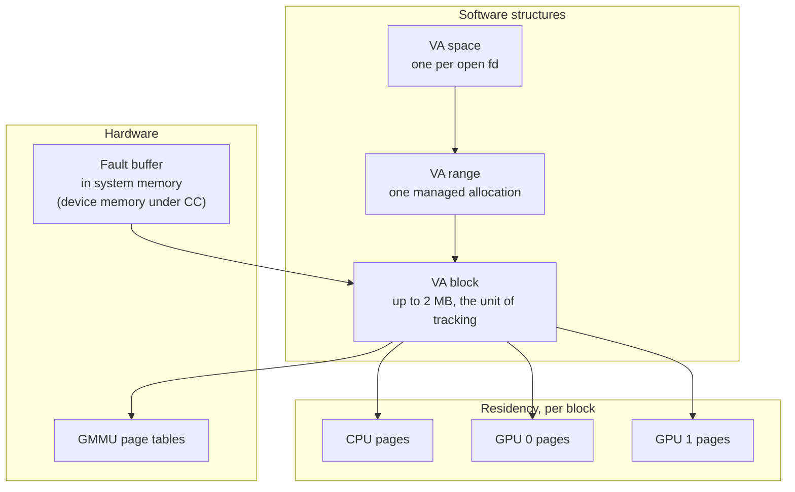

Unified memory makes one allocation addressable from the CPU and from every GPU
in the system, migrating pages so the processor touching them holds them
locally. `nvidia-uvm.ko` implements it. The module is separate from
`nvidia.ko`, with its own device nodes, its own command numbering in
`kernel-open/nvidia-uvm/uvm_ioctl.h` and its own fault handling. The Resource
Manager escape convention applies to none of it.

## The nodes

Two device nodes carry the interface. Their 46 commands form two of the seven
targetable families, and both families are fully modelled.

| Node | Commands | Carries |
| --- | --- | --- |
| `/dev/nvidia-uvm` | 39 | VA space setup, GPU registration, range creation and destruction, range policy, migration |
| `/dev/nvidia-uvm-tools` | 7 | The event and counter interface profilers attach to |

A third dispatcher on `/dev/nvidia-uvm` holds 104 `UVM_TEST_` commands. The
module ships with them compiled in and refuses them at runtime:
`uvm_test_ioctl` returns `-ENOSYS` unless the module was inserted with
`uvm_enable_builtin_tests=1` (`kernel-open/nvidia-uvm/uvm_test.c:260`). A stock
module dispatches none of them.

## Command numbering

An RM escape number is an `_IOWR` code built by `__NV_IOWR`, encoding a magic
byte, a direction and the parameter size. UVM defines `UVM_IOCTL_BASE(i)` as
`i`. A UVM request number is the bare ordinal, with no size and no direction
encoded in it.

The parameter size therefore derives from the command number alone. Each `case`
in the dispatcher names a parameter type, and the route macro copies `sizeof`
that type from the user pointer. `UVM_MAX_IOCTL_PARAM_STACK_SIZE` in
`kernel-open/nvidia-uvm/uvm_api.h` divides the two copy paths at 288 bytes, and
a `BUILD_BUG_ON` in each macro enforces the division at compile time.

| Copy path | Commands | Destination |
| --- | --- | --- |
| `UVM_ROUTE_CMD_STACK_*` | 36 | A stack local in the ioctl frame |
| `UVM_ROUTE_CMD_ALLOC_*` | 2 | `uvm_kvmalloc` |
| None | 1 | `UVM_DEINITIALIZE` declares no parameter struct |

Measured parameter sizes on the node run from 4 bytes to 9264, over the 38
commands that declare a struct. Two exceed the 288-byte division:
`UVM_MAP_EXTERNAL_ALLOCATION` at 9264 and `UVM_ALLOC_SEMAPHORE_POOL` at 9248,
both carrying large embedded arrays.

## The initialisation gate

36 of the 39 commands test `uvm_fd_va_space(filp)` before the handler runs, and
return `NV_ERR_ILLEGAL_ACTION` when the descriptor has no VA space attached.
Three do not.

| Command | Effect |
| --- | --- |
| `UVM_INITIALIZE` | Attaches a VA space to the descriptor |
| `UVM_MM_INITIALIZE` | Associates the caller's mm with that VA space |
| `UVM_DEINITIALIZE` | Releases the VA space |

The gate stands where a control command's object chain stands, and costs one
call. A control command can require a chain of up to five allocations before it
can be aimed at anything. `UVM_INITIALIZE` on an open descriptor opens the
other 36. The seven `uvm-tools` commands test nothing, because that node
maintains its own state.

## The structures

Three nested structures hold the state the commands operate on.

| Structure | Scope | Holds |
| --- | --- | --- |
| VA space | One open descriptor | Every managed range, and which GPUs are registered to it |
| VA range | One managed allocation | The range's policy: preferred location, accessed-by set, read duplication |
| VA block | Up to 2 MB of a range, `UVM_VA_BLOCK_BITS` 21 in `kernel-open/nvidia-uvm/uvm_va_block_types.h:42` | Per-page residency and mapping state for every processor |

A migration is a change to a VA block's per-page state, followed by the page
table updates that change requires.

## The fault path

The hardware supplies the input to fault handling. The GPU writes fault entries
into a buffer. The driver drains a batch, groups the entries by VA block,
selects a destination per group, moves pages, rewrites page tables and issues
one replay.

Two fault classes reach it, and only one is replayable.

| Class | Raised by | Handling |
| --- | --- | --- |
| Replayable | An SM executing a memory instruction | The warp stalls, the driver services the fault, the access is replayed. This is the migration path |
| Non-replayable | A copy engine or another engine that cannot re-issue | The channel is faulted off and the fault is reported as an error |

The driver allocates the fault buffer in system memory. Confidential Computing
moves it to device memory, a choice `kgmmuFaultBufferGetAddressSpace` makes at
initialisation.

## Range policies

Five policies determine where a page resides. Four are set through UVM
commands, which makes them ioctl parameters and part of the state a caller
controls.

| Policy | Set by | Behaviour |
| --- | --- | --- |
| First touch | Nothing. It is the default | A page migrates to whichever processor faults on it |
| Preferred location | `UVM_SET_PREFERRED_LOCATION` | Pages remain at the named processor and are mapped remotely for others |
| Accessed by | `UVM_SET_ACCESSED_BY` | The named processor receives a mapping, with no migration |
| Read mostly | `UVM_ENABLE_READ_DUPLICATION` | Read-only copies are duplicated to each reader, with no migration |
| Prefetch | `UVM_MIGRATE` | An explicit bulk migration ahead of use |

The driver also detects a page migrating repeatedly between the same
processors, pins it, and maps it remotely for the others.

## See also

- [Memory model](/gspwn/knowledgebase/memory-model/)
- [RM control command surface](/gspwn/knowledgebase/rm-control-surface/)
- [Resource Manager object model](/gspwn/knowledgebase/rm-object-model/)
