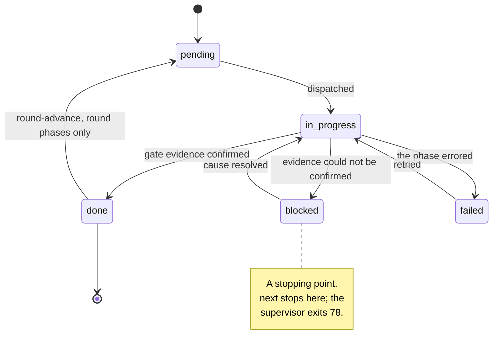
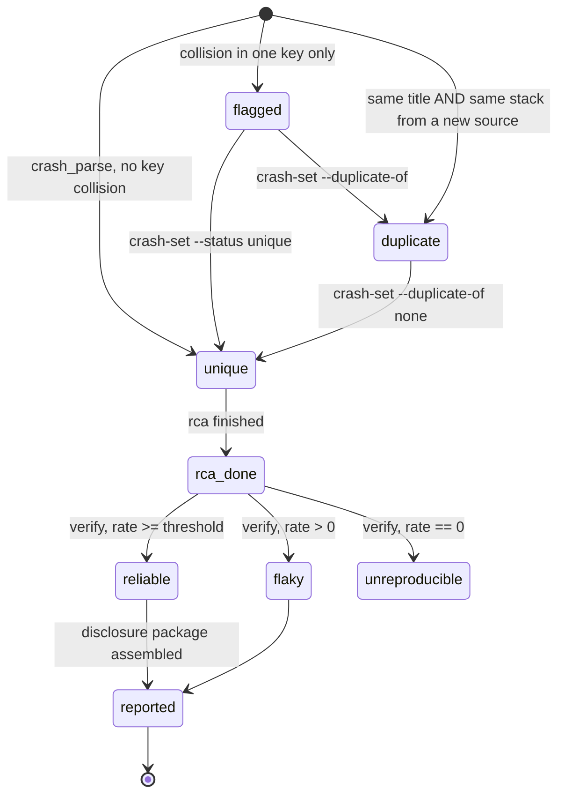

`state/pipeline.json` holds the pipeline's execution position. Schema version
2, gitignored, written only by the tools. `GSPWN_STATE` redirects the path. The
spend ledger stays at its default path under that redirect.

## Top level

| Field | Type | Contents |
|---|---|---|
| `version` | integer | `2` |
| `phases` | object | Phase name to phase record, one per phase in `PHASES` |
| `crashes` | object | Crash id to crash record |
| `campaigns` | array | Append-only campaign event log |
| `rounds` | array | One round record per round, numbered sequentially from 1 |
| `manifest` | string | Path to the build manifest, `artifacts/builds/manifest.json` |
| `triage_settings` | object | The dedup settings the registry's hashes were produced under |

Unknown top-level keys are preserved on read, so a newer writer's fields
survive an older reader.

## Phase record

| Field | Type | Contents |
|---|---|---|
| `status` | string | `pending`, `in_progress`, `done`, `blocked`, `failed` |
| `updated` | string or null | ISO-8601 UTC timestamp of the last status change |
| `notes` | string | Free text describing **this** status change |

Every status change replaces the note. A "gate ok" note cannot survive onto a
later `failed` status.



`next_phase` walks the phase list in order and returns the first that is not
`done`. A `blocked` or `failed` phase stops the walk, because that phase is the
one needing attention.

## Crash record

| Field | Type | Contents |
|---|---|---|
| `track` | string | `K` or `U` |
| `title` | string | The canonicalised report title |
| `stack_hash` | string | SHA-1 prefix of the top frames, or empty when the report carries none |
| `status` | string | `unique`, `duplicate`, `flagged`, `reliable`, `flaky`, `unreproducible`, `rca_done`, `reported` |
| `dir` | string | The source directory or file this sighting came from |
| `repro_rate` | number or null | Hits divided by counted runs, between 0.0 and 1.0 |
| `duplicate_of` | string or null | The surviving entry's crash id |
| `disclosure` | string | `pending`, `submitted`, `resolved`, `not_applicable` |
| `notes` | string | Free text |
| `signal` | string | `signal`, `review`, `health`, `noise`, `unclassified` |
| `rca_done_at` | string or null | When `rca` finished with this crash. Stamped once, never cleared |
| `finding` | object or null | The research record |
| `impact` | object or null | The impact record |
| `history` | array | Append-only status trail |
| `repro_progress` | object | Verification progress, written by `repro_ctl.py` |
| `repro_runs_counted` | integer | Counted runs behind the recorded rate |
| `repro_runs_requested` | integer | Counted runs the verification asked for |



`rca_done` is transient: the `poc` phase writes the reproduction class straight
over it. `rca_done_at` is the durable stamp, and `validate`'s "analysed but no
record" checks key on it.

### history

Appended on every status change that changes the value, so a reclassification
preserves the record of the earlier one.

```json
{"ts": "2026-08-16T04:12:07+00:00", "from": "rca_done", "to": "reliable", "tool": "repro_ctl"}
```

### repro_progress

| Field | Type | Contents |
|---|---|---|
| `runs_done` | integer | Attempts made, including void ones |
| `hits` | integer | Runs scored as a reproduction |
| `inconclusive` | integer | Void runs, excluded from the rate |
| `in_flight` | boolean | A run was started and no verdict was recorded |
| `boot_id` | string or null | The boot the in-flight run started on |
| `timeouts` | integer | Runs that exceeded `poc.repro_timeout_sec` |
| `timeout_hits` | integer | Those timeouts that scored as hang-class hits |
| `weak_hits` | integer | Hits resting on a boot-id change alone |
| `evidence` | string or null | The evidence class of the last hit. See [Closed vocabularies](/gspwn/reference/vocabularies/) |

## Research record

| Field | Type | Contents |
|---|---|---|
| `subsystem` | string | Required. The key `refine` groups by |
| `bug_class` | string | One of the bug classes |
| `trigger` | string | One of the triggers |
| `ioctls` | array of strings | The calls the reproducer made, in call order |
| `preconditions` | array of strings | State that must already exist |
| `adjacent` | array of strings | Calls sharing an object, lock, refcount or teardown path, not exercised |
| `source_refs` | array of strings | `file.c:line` into the driver source |
| `hypothesis` | string | The underlying pattern |
| `confidence` | string | `low`, `medium`, `high` |
| `no_adjacent_reason` | string | Required when `adjacent` is empty |

List fields are cleaned to non-empty strings, deduplicated, with order
preserved, because `describe` models a sequence.

Unknown fields are refused. A misspelled `ioctl` would otherwise be accepted,
leave `ioctls` empty, and hand the next round a record with nothing to model
while every command reported success.

## Impact record

| Field | Type | Contents |
|---|---|---|
| `primitive` | string | What the violation hands an attacker |
| `consequence` | string | The highest outcome the evidence supports |
| `cwe` | string | `CWE-nnn`, or empty to derive it from `bug_class` |
| `corrupted_object` | string | The struct or allocation the fault touches |
| `cache` | string | The slab cache or size class it comes from |
| `access_type` | string | `read`, `write`, `free`, `unknown` |
| `access_size` | integer or null | Bytes, from the sanitizer report |
| `overwrite_target` | string | Which field the corruption lands on |
| `reclaim_path` | string | How a freed allocation can be re-occupied |
| `race_window` | string | What has to interleave |
| `allocation_site` | string | `file.c:line` |
| `free_site` | string | `file.c:line` |
| `access_site` | string | `file.c:line` |
| `attacker_control` | array of strings | What the attacker influences |
| `evidence` | array of strings | The references behind the claim |
| `unverified` | array of strings | Claims not checked against source |
| `confidence` | string | `low`, `medium`, `high` |
| `undetermined_reason` | string | Required when either verdict is `undetermined` |

Value sets: [Closed vocabularies](/gspwn/reference/vocabularies/).

## Round record

| Field | Type | Contents |
|---|---|---|
| `round` | integer | Sequential from 1 |
| `status` | string | `in_progress` or `complete` |
| `started`, `ended` | string or null | ISO-8601 UTC |
| `run_ids` | array of strings | Campaigns attached to this round |
| `coverage_verdict` | string | `growing`, `plateaued`, `unknown` |
| `edges_start`, `edges_end` | integer or null | The round's Track K edge totals |
| `new_crashes` | integer | Crashes that count as findings |
| `run_hours` | number | Total billed hours, accumulated across `round-end` calls |
| `run_hours_by_run` | object | Run id to hours, which `run_hours` sums |
| `decision` | string or null | `continue` or `stop` |
| `decision_reason` | string | Why |
| `worklist` | string or null | The path this round's `refine` produced |
| `worklist_in` | string or null | The path this round's `describe` and `seeds` must execute |
| `notes` | string | The derived per-run detail lines |

`run_hours` accumulates because a round routinely spans several campaigns and
`round-end` is called once per run. Re-billing a run id corrects that run's
entry and adjusts the total by the delta.

## Campaign event

| Field | Type | Present on | Contents |
|---|---|---|---|
| `track` | string | Every event | `K` or `U` |
| `action` | string | Every event | `install`, `start`, `stop`, `record` |
| `at` | string | Every event | ISO-8601 UTC |
| `run_id` | string | `install`, `start`, `stop` | The campaign this event belongs to |
| `hours` | number | `install` | The campaign window in hours |
| `note` | string | `install`, `record`, and a `stop` written by `check-deadline` or `--replace` | Free text |

```json
{"track": "K", "action": "install", "run_id": "r2-1", "at": "2026-08-15T15:31:04+00:00",
 "hours": 24, "note": "campaign window 24.0 h"}
```

A lost deadline file is reconstructed from the `install` event, which is why it
carries `hours` and `at`. Only stops that succeeded are recorded.

## triage_settings

| Field | Type | Source key |
|---|---|---|
| `stack_hash_frames` | integer | `triage.stack_hash_frames` |
| `signature_frames` | integer | `triage.signature_frames` |
| `frameless_signature_lines` | integer | `triage.frameless_signature_lines` |
| `frameless_signature_chars` | integer | `triage.frameless_signature_chars` |

```json
{"stack_hash_frames": 3, "signature_frames": 5,
 "frameless_signature_lines": 5, "frameless_signature_chars": 300}
```

Written once, at the first registration, and never overwritten. It records the
settings the stored hashes were produced under. Rewriting it would erase that
record.

## Integrity checks

`pipeline_ctl.py validate` runs the following checks over the state file.

| Check | Problem reported |
|---|---|
| Dedup drift | `triage.X is N now but the registry's hashes were built with M` |
| Phase status | An invalid status value |
| Phase ordering | A phase done while an earlier one is not, except among `describe`, `seeds` and `harness`, which are order-independent after `build` |
| Crash fields | An invalid status, track or disclosure value |
| Self-duplication | A crash marked a duplicate of itself |
| Dangling link | `duplicate_of` naming an unknown crash |
| Link without status | `duplicate_of` set while the status is not `duplicate` |
| Status without link | Status `duplicate` with no `duplicate_of` |
| Chains and cycles | `duplicate_of` pointing at another duplicate |
| Rate range | `repro_rate` outside 0.0 to 1.0 |
| Invalid finding | A record that fails normalisation |
| Inert finding | A record that cannot steer the next round |
| Missing finding | A crash with an `rca_done_at` stamp and no research record |
| Invalid impact | A record that fails normalisation |
| Unsupported impact | A record that does not support its own conclusion |
| Missing impact | A crash with an `rca_done_at` stamp and no impact record |
| Round numbering | Rounds not sequential from 1 |
| Round verdict | An invalid coverage verdict or decision |
| Unclosed round | A superseded round whose decision is not `continue` |

Duplicates are exempt from the finding and impact checks, because they describe
the same bug as their surviving entry.

## Durability

| Operation | Guarantee |
|---|---|
| Write | Temporary file, `fsync`, atomic rename, then `fsync` of the parent directory |
| Backup | The previous good file is kept as `state/pipeline.json.bak`, which the corrupt-state error message points at |
| Read-modify-write | A transaction holding an exclusive `flock` on `state/.pipeline.lock` for the whole cycle |

A load-and-save pair without the transaction loses updates when parallel
sub-agents are running.

See [Durability](/gspwn/architecture/durability/).

## Reading the state file

```
python3 tools/pipeline_ctl.py show --json
```

## See also

- [Closed vocabularies](/gspwn/reference/vocabularies/)
- [pipeline_ctl.py](/gspwn/reference/cli/pipeline-ctl/)
